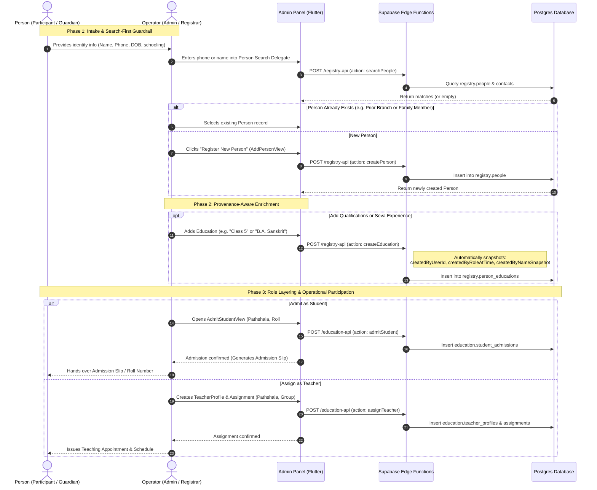

# Gita Pathshala — Feature Completion Guide

**Target Launch Date: 10 October 2026**
**Audience: Frontend Developer (Admin Panel)**
**Last Updated: 30 September 2026**

---

> [!IMPORTANT]
> Read this entire document before touching any code.
> Every section explains the **why** before the **what**.
> Violating the architecture here creates bugs that are extremely hard to fix later.

---

## The One Rule That Governs Everything

> **A Person is REGISTERED first. Roles (Student, Teacher, Admin) are ASSIGNED later.**

This is not a preference — it is the core business rule of this entire platform.

**WRONG mental model:**
```
"Add Teacher" → fill in teacher name, phone, subject → save → done
"Add Student" → fill in student name, phone, class → save → done
```

**CORRECT mental model:**
```
Step 1: Register a Person (name, phone, date of birth) — once, ever
Step 2: Search for that Person
Step 3: Assign them a role (Admit as Student / Create Teacher Profile / Assign to class)
```

**Why?** Because one human can be:
- A student at one Pathshala
- A teacher at another Pathshala simultaneously
- A committee member at the organization level

If we create separate "teacher records" and "student records" for the same human, we lose identity continuity, get duplicate data, and the system can never answer "who is this person across the whole organization?"

---

## How the Data Model Works (READ THIS CAREFULLY)

```
Person (Registry — created ONCE)
├── PersonId, LegalName, DateOfBirth, Phone, Email
│
├── PersonEducation (Registry — Qualifications & Schooling)
│   ├── personId → links to Person
│   ├── academicLevel ("Class 4", "SSC", "B.Sc in CS", "M.A. Sanskrit", "Gita Shastri")
│   ├── disciplineOrGroup, institutionName, governingBoard
│   ├── startYear, passingYear, isOngoing, resultOrScore
│   └── Provenance: createdByUserId, createdByRoleAtTime, createdByNameSnapshot
│
├── PersonWorkExperience (Registry — Employment & Volunteer Service)
│   ├── personId → links to Person
│   ├── organizationName, roleOrDesignation, departmentOrUnit, engagementType
│   ├── startDate, endDate, isOngoing, responsibilities
│   └── Provenance: createdByUserId, createdByRoleAtTime, createdByNameSnapshot
│
├── StudentAdmission (Operational Record)
│   ├── personId → links to Person
│   ├── pathshalaId → which Pathshala admitted them
│   ├── rollNumber
│   └── admissionDate, status
│
├── TeacherProfile (Operational Record)
│   ├── personId → links to Person
│   ├── organizationId
│   └── status, joinedDate
│     │
│     └── TeacherAssignment (Operational Record)
│         ├── teacherProfileId → links to TeacherProfile
│         ├── pathshalaId → which Pathshala they teach at
│         ├── groupId → which class group
│         └── effectiveFrom, effectiveTo
│
└── GovernanceRole (future)
    ├── personId
    └── roleType (Admin, Committee Member, etc.)
```

**The key entities in code:**
- `Person` — root identity (`lib/src/features/person/domain/entities/person.dart`)
- `PersonEducation` — schooling/degree qualifications (`lib/src/features/person/domain/entities/person_education.dart`)
- `PersonWorkExperience` — job & volunteer history (`lib/src/features/person/domain/entities/person_work_experience.dart`)
- `StudentAdmission` — the act of admitting a person as a student (`lib/src/features/person/domain/entities/student_admission.dart`)
- `TeacherProfile` — the teacher credential of a person (`lib/src/features/person/domain/entities/teacher_profile.dart`)
- `TeacherAssignment` — which Pathshala/class the teacher is assigned to (`lib/src/features/person/domain/entities/teacher_assignment.dart`)

---

## User Journey Behaviour: Person (Participant) vs. Operator (Admin)

To build the UI flows correctly, developers must understand the interaction dynamic between the **Person** (the individual human being participating in the organization) and the **Operator** (the authorized administrator entering and managing details in the Admin Panel).

In Gita Pathshala, **public self-registration is intentionally disabled**. All registrations, admissions, and assignments are governed and entered by authorized operators (Central Super Admins, District Coordinators, or local Pathshala Admins).



---

### Journey A: The Person Who Registers (Student, Teacher, or Devotee)

The **Person** is the human subject. They may be a young child, a teenager, an adult volunteer, an academic scholar, or an elderly devotee.

#### 1. Intake & Identity Registration Stage
* **What they experience:**
  * The person (or their parent/guardian if a child) arrives at the Pathshala intake desk or submits a paper/intake form.
  * They provide fundamental identity details:
    * **Full Legal Name** (in English and Bengali script if applicable)
    * **Primary Contact Phone** (either personal or parent's phone)
    * **Date of Birth & Gender**
    * **Residential Address & Guardian Details** (Father, Mother, or Guardian name & emergency contact)
  * **System Impact:** The person receives an immutable, universal `personId`. They are recognized across the *entire* Gita Pathshala organization once and for all.

#### 2. Academic & Experience Enrichment Stage
* **What they experience:**
  * If a **child/school student**: They state their current school grade (e.g., *"Class 4 at Ideal School, Motijheel"*). This is stored as a `PersonEducation` record with `isOngoing = true`.
  * If an **adult volunteer / teacher**: They share their formal degrees (e.g., *"B.A. in Sanskrit from Dhaka University"*, *"Gita Shastri Certification"*) and their volunteer/professional background (e.g., *"Volunteer Teacher at Ramakrishna Mission for 3 years"*).
  * **System Impact:** Qualifications and service histories attach directly to the `Person` root identity, independent of which specific branch they teach at today.

#### 3. Operational Role Enactment Stage
* **Student Journey:**
  * The person is admitted into a specific local Pathshala branch (e.g., *Dhanmondi Pathshala*).
  * They receive a **Roll Number** and are placed into an Educational Group (e.g., *Shishu Vibhag* or *Madhyama Vibhag*).
  * They attend weekly classes, have attendance recorded against their admissions, and receive evaluation marks.
* **Teacher Journey:**
  * The person is recognized as a qualified teacher (`TeacherProfile`).
  * They are assigned to teach specific class groups on scheduled days (e.g., *Saturday 10:00 AM – Bhagavad Gita Chapter 2 Slokas*).
  * They may teach at **multiple Pathshalas** simultaneously without requiring multiple user profiles.

#### 4. Progression, Mobility & Lifelong Continuity
* **Transfers without History Loss:**
  * When a family relocates (e.g., from Dhanmondi to Uttara), the person is not deleted or renamed.
  * The Dhanmondi admission is marked as transferred/completed. A new `StudentAdmission` is issued at Uttara.
  * The person retains their complete lifelong transcript and attendance history across all branches.
* **Role Evolution Over Time:**
  * A student who joins at age 8 can graduate at age 16, become an Assistant Teacher at age 18, and join the Pathshala Management Committee at age 25.
  * All roles, admissions, teaching assignments, and committee appointments link to the **exact same `personId`**.

---

### Journey B: The Operator Entering Details (Admin / Registrar)

The **Operator** is the authorized staff member (Central Super Admin, District Coordinator, or local Pathshala Admin) sitting in front of the Admin Panel desktop/web application.

#### 1. Mandatory Search-First Guardrail (Anti-Duplicate Protocol)
* **What the operator does:**
  * When a student or teacher arrives for onboarding, the operator **never** opens an isolated "Create Student" form.
  * The operator opens the **Person Search Widget / Dialog** (`PersonSearchDelegate`).
  * The operator types the phone number or name:
    * **Match Found:** The operator clicks the matching card, verifies the date of birth or guardian name, and selects the existing `Person`.
    * **No Match:** The operator clicks **"+ Register New Person"**, transitioning into `AddPersonView`.
* **System Impact:** Prevents duplicate human records, fragmented phone lookups, and fractured institutional memory.

#### 2. Governed Person Creation (`AddPersonView`)
* **What the operator does:**
  * Fills out the standard person form: Legal Name, Primary Phone, Email (optional), Date of Birth, Gender, Address.
  * Submits the form. The UI displays an active loading indicator while calling `CreatePersonController.createPerson()`.
  * Upon success, the UI automatically transitions to `PersonDetailsView` or advances to the next step of the onboarding wizard.

#### 3. Provenance-Aware Educational & Experience Enrichment
* **What the operator does:**
  * On the Person Details screen, under the **"Education"** tab, clicks **"+ Add Qualification / Schooling"**.
  * Fills in `academicLevel` (e.g. `"Class 5"` for a school student, or `"B.A. in Sanskrit"` for a teacher), institution name, board, and passing/ongoing status.
  * If registering a prospective teacher, switches to the **"Experience"** tab and logs past institutions and seva engagements.
* **Audit & Provenance Automation:**
  * The operator **never** manually enters audit fields.
  * The client layer automatically grabs the current operator's active session from `AppSession` and snapshots:
    * `created_by_user_id`: The operator's Supabase auth UUID.
    * `created_by_role_at_time`: The role string at the moment of entry (e.g., `'SuperAdmin'`, `'PathshalaAdmin'`).
    * `created_by_name_snapshot`: The operator's full display name (e.g., `'Shyamal Das'`).
  * This guarantees institutional accountability: anyone reviewing the record 5 years later knows exactly who verified and recorded that qualification.

#### 4. Role Assignment & Admission with Scoped Authorization
* **Admitting a Student:**
  * Operator clicks **"Admit Student"** from either the Student List or the Person Details view.
  * If the operator is a local **PathshalaAdmin**, the Pathshala dropdown is **pre-selected and locked** to their authorized Pathshala scope.
  * If the operator is a **SuperAdmin**, they can select any active Pathshala across the country.
  * The operator inputs the assigned **Roll Number**, chooses the **Admission Date**, and confirms.
* **Assigning a Teacher:**
  * Operator clicks **"Assign Teacher"**.
  * The system verifies if the person already has a `TeacherProfile`. If not, it seamlessly creates the profile first.
  * Operator selects the Pathshala branch, target Class Group, and effective date.
  * The system validates that there is no schedule conflict before committing.

#### 5. Confirmation, Slips & Operational Feedback
* **What the operator experiences:**
  * Clear success feedback: Toast/Snack bar indicating successful admission or assignment.
  * A printable / previewable **Student Admission Slip** or **Teacher Appointment Summary** containing:
    * Person Full Name, Photo/Placeholder, Person ID
    * Pathshala Name & Location
    * Roll Number, Class Group, and Academic Year
    * Timestamp and Operator Signature / Provenance Stamp
  * The operator hands the slip or confirms the roll number with the student/guardian.

---

### UX Behavioral Matrix for Developers

| Step | User Action (Operator) | View / Widget | Underlying Use Case | Edge Function Called | Error / Duplicate Handling |
|---|---|---|---|---|---|
| **1. Search** | Type phone or name | `PersonSearchDelegate` | `SearchPeople` | `registry-api` | If phone matches existing person, show banner: *"Person already registered. Click to view profile."* |
| **2. Register Person** | Fill name, phone, DOB | `AddPersonView` | `CreatePerson` | `registry-api` | Reject invalid phone; warn on duplicate name + DOB combination. |
| **3. Add Education** | Enter academic level & school | `AddEducationDialog` | `AddPersonEducation` | `registry-api` | Auto-inject operator's `userId`, `roleAtTime`, and `nameSnapshot`. |
| **4. Add Experience** | Enter organization & role | `AddExperienceDialog` | `AddPersonWorkExperience` | `registry-api` | Auto-inject operator's provenance snapshot. |
| **5. Admit Student** | Select Pathshala & roll # | `AdmitStudentView` | `AdmitStudent` | `education-api` | Validate roll number uniqueness within that Pathshala and academic year. |
| **6. Assign Teacher** | Select Group & effective date | `AddTeacherView` (rebuilt) | `CreateTeacherProfile` + `AssignTeacher` | `education-api` | Alert if person already has an overlapping active assignment in the same time slot. |

---

## Current State of Each Feature

| Feature | Status | Problem |
|---|---|---|
| Person Registry (list, register) | Working | Good baseline |
| Add Person Form | Working | Clean, uses proper controller |
| Teachers List View | Partial | Exists but "Add Teacher" is broken |
| **Add Teacher Flow** | **BROKEN** | Creates a fake `TeacherModel` locally. Never calls any use case. Has no `personId`. Must be deleted and rebuilt. |
| Students List View | Partial | List exists, "Admit Student" is missing |
| **Admit Student Flow** | **MISSING** | No view exists. Must be built from scratch. |
| Pathshala Details (tabs) | Shell only | Tabs for Teacher/Student/Attendance not wired to real data |
| Classes / Schedule | Shell only | Views exist, need data wiring |
| Person Details View | **MISSING** | Must be built — shows all journeys of one person |
| Attendance | Placeholder | View exists, not functional |
| Reports | Placeholder | View exists, not functional |
| Dashboard | Placeholder | Static numbers, needs real data |

---

## Step-by-Step Completion Tasks

Work through these in order. Do not skip ahead.

---

### TASK 1 — Delete and Replace AddTeacherView

**Priority: CRITICAL — Do this first**

#### What is wrong right now

`lib/src/features/person/presentation/view/add_teacher_view.dart` does this on save:

```dart
Navigator.of(context).pop<Teacher>(
  TeacherModel(
    id: 'teacher-${DateTime.now().millisecondsSinceEpoch}', // FAKE ID — never persisted
    name: name,  // TeacherProfile has no 'name' field — name belongs to Person
    // ... and it never calls any use case at all
  ),
);
```

This is completely wrong. It:
- Creates a `TeacherModel` with a fake generated ID
- Never calls `CreateTeacherProfile` or `AssignTeacher` use cases
- Has no `personId` — it is not linked to any registered person
- Would never persist anything to the backend

#### What the correct flow must be

```
User clicks "Assign Teacher" in TeachersView
    |
    v
Step 1: Person Search Dialog
    - Text field to search by name or phone
    - Calls SearchPeople use case
    - Shows matching persons from registry
    - User selects a person
    |
    v
Step 2: Confirm Teacher Profile
    - Shows the selected person's details (read-only)
    - If person already has a TeacherProfile → skip to Step 3
    - If not → calls CreateTeacherProfile use case
    |
    v
Step 3: Create Teacher Assignment
    - Select Pathshala (dropdown)
    - Select Class Group (dropdown)
    - Set effective from date
    - Calls AssignTeacher use case
    |
    v
TeachersView refreshes with updated list
```

#### Use cases already available — DO NOT create new ones

| Action | Use Case class | File |
|---|---|---|
| Search persons | `SearchPeople` | `lib/src/features/person/domain/usecases/search_people.dart` |
| Create teacher profile | `CreateTeacherProfile` | `lib/src/features/person/domain/usecases/create_teacher_profile.dart` |
| Assign teacher | `AssignTeacher` | `lib/src/features/person/domain/usecases/assign_teacher.dart` |

#### Params to use

```dart
// Step 2
CreateTeacherProfileParams(
  personId: selectedPerson.id,      // MUST come from search result
  organizationId: org.id,
)

// Step 3
AssignTeacherParams(
  teacherProfileId: profile.id,     // from step 2 result
  pathshalaId: selectedPathshala.id,
  groupId: selectedGroup.id,
  role: 'primary',
  effectiveFrom: DateTime.now(),
)
```

#### What to do with the file

Delete the content of `add_teacher_view.dart` and rebuild it as a multi-step form. The filename can stay. The implementation must be completely rewritten.

---

### TASK 2 — Build the Admit Student Flow

**Priority: CRITICAL**

#### What is missing

There is **no view** for admitting a student. The `StudentsView` has a button but it has no destination.

#### What the correct flow must be

```
User clicks "Admit Student" in StudentsView
    |
    v
Step 1: Person Search Dialog (reuse the same widget from Task 1)
    - Search by name or phone
    - Select a person from results
    |
    v
Step 2: Admission Details Form
    - Select Pathshala (dropdown from ListPathshalas)
    - Roll Number (text input)
    - Admission Date (date picker, defaults to today)
    - Calls AdmitStudent use case
    |
    v
StudentsView refreshes
```

#### Use cases already available

| Action | Use Case class | File |
|---|---|---|
| Search persons | `SearchPeople` | `lib/src/features/person/domain/usecases/search_people.dart` |
| Admit student | `AdmitStudent` | `lib/src/features/person/domain/usecases/admit_student.dart` |

#### Params to use

```dart
AdmitStudentParams(
  organizationId: org.id,
  pathshalaId: selectedPathshala.id,
  personId: selectedPerson.id,   // MUST come from person search
  rollNumber: rollNumberController.text,
)
```

#### Files to create

- `lib/src/features/person/presentation/view/admit_student_view.dart`
- (Optional) `lib/src/features/person/presentation/controller/admit_student_controller.dart`

---

### TASK 3 — Build a Shared Person Search Widget

**Priority: HIGH — Needed by both Task 1 and Task 2**

Tasks 1 and 2 both require a "search and select a person" step. Build it **once** as a reusable widget.

#### Suggested location

```
lib/src/features/person/presentation/widgets/person_search_delegate.dart
```

#### What it should do

- Accept a callback: `void Function(Person selectedPerson) onPersonSelected`
- Show a search input field
- On text change: call `SearchPeople` use case with `SearchPeopleParams(query: text)`
- Show a list of matching `Person` results
- On tap: call `onPersonSelected(person)` and close/dismiss

#### How to use it

```dart
// In AssignTeacherView or AdmitStudentView
PersonSearchDelegate(
  onPersonSelected: (person) {
    setState(() => _selectedPerson = person);
  },
)
```

#### SearchPeople params

```dart
SearchPeopleParams(
  query: searchText,    // name or phone
  organizationId: org.id,
)
```

---

### TASK 4 — Build Person Details View

**Priority: HIGH**

#### What it is

When an admin taps on a person in `AllPeopleView`, they should see a full profile of that person:

- Basic info (name, phone, DOB, email)
- All student admissions (which Pathshala, roll number, status, date)
- Teacher profile (if any) and all teaching assignments
- Governance roles (can show "none" for now)

#### Why it matters

Without this screen, admins cannot verify a person's history, diagnose errors, or understand a person's full relationship with the organization.

#### Suggested file

```
lib/src/features/person/presentation/view/person_details_view.dart
```

#### What it should show (tabs)

```
Header: Name, Status badge, Phone, Email, DOB

Tabs:
  Overview       → Basic info cards (contacts, emergency, relationships)
  Education      → List of academic credentials / school classes (academicLevel, school, board, ongoing/passed)
                   Button: "+ Add Qualification / Schooling"
  Experience     → Work and volunteer history (organization, role, dates, ongoing)
                   Button: "+ Add Experience"
  Student Roles  → Table: Pathshala | Roll | Status | Date
                   Button: "Admit to Pathshala"
  Teacher Roles  → Table: Pathshala | Group | From | To
                   Button: "Assign as Teacher"
```

#### Use cases to call

| Data | Use Case | Purpose |
|---|---|---|
| Person details | `GetPersonById` | Core identity info |
| Education list | `GetPersonEducations` | All qualifications / school grades |
| Add education | `AddPersonEducation` | Add new qualification with role snapshot |
| Experience list | `GetPersonWorkExperiences` | Work & volunteer history |
| Add experience | `AddPersonWorkExperience` | Add new experience with role snapshot |
| Student admissions | `ListStudentAdmissions` | Pathshala admissions |
| Teacher assignments | `ListTeacherAssignments` | Teaching assignments |

---

### TASK 5 — Wire Pathshala Details Tabs to Real Data

**Priority: HIGH**

`lib/src/features/pathshala/presentation/view/patshala_details_view.dart` already has tabs:

```dart
static const _tabs = ['সারসংক্ষেপ', 'প্রশাসক', 'শিক্ষক', 'শিক্ষার্থী', 'উপস্থিতি', 'কার্যক্রম'];
//                      Overview,     Admin,      Teacher,   Student,     Attendance,  Activity
```

These tabs need to show real data.

#### Tab: Teacher (শিক্ষক)
- Call `ListTeacherAssignments(pathshalaId: pathshala.id)`
- Show table: Person Name | Group | Status | Since
- Button: "Assign Teacher" → Task 1 flow

#### Tab: Student (শিক্ষার্থী)
- Call `ListStudentAdmissions(pathshalaId: pathshala.id)`
- Show table: Person Name | Roll | Status | Admission Date
- Button: "Admit Student" → Task 2 flow

#### Tab: Attendance (উপস্থিতি)
- Show placeholder: "Attendance recording coming soon"
- Lower priority for launch

> [!NOTE]
> The `PathshalaDetailsController` is already registered in DI. Use it. Do not create a new controller.

---

### TASK 6 — Wire Students View to Real Data

**Priority: MEDIUM**

`students_view.dart` and `students_controller.dart` should show a list of all `StudentAdmission` records.

- Call `ListStudents` use case
- Show: Person Name | Pathshala | Roll | Status
- "Admit Student" button → Task 2 flow
- Each row tappable → goes to `PersonDetailsView` (Task 4)

---

### TASK 7 — Wire Teachers View to Real Data

**Priority: MEDIUM**

`teachers_view.dart` and `teachers_controller.dart` should show all persons with a teacher profile.

- Call `ListTeachers` use case
- Show: Person Name | Status | Pathshala | Group
- "Assign Teacher" button → Task 1 flow (rebuilt)
- Each row tappable → goes to `PersonDetailsView` (Task 4)

---

### TASK 8 — Dashboard with Real Stats

**Priority: MEDIUM**

`DashboardView` should show live counts. Do not hardcode numbers.

| Stat | How to get it |
|---|---|
| Total registered persons | `ListPeople` → count |
| Total active students | `ListStudents` → count |
| Total teachers | `ListTeachers` → count |
| Total Pathshalas | `ListPathshalas` → count |

---

### TASK 9 — Classes and Schedule

**Priority: LOWER — Do after Tasks 1 to 5**

- `add_class_view.dart` — wire up the form to call relevant use cases
- `class_schedule_view.dart` — show class schedules per Pathshala
- Use: `ListEducationalGroups`, `ListClassSchedules`, `ListAcademicYears`

---

### TASK 10 — Notices

**Priority: LOWER**

- `notices_view.dart` — wire to `GetNotices` and `PublishNotice` use cases
- Publish notice form: title, body, target (Pathshala or All)

---

## What You Must NEVER Do

| Do NOT do this | Do this instead |
|---|---|
| Create a teacher by filling in their name in an "Add Teacher" form | Search for an existing Person, then assign TeacherProfile |
| Create a student by filling in their name in an "Add Student" form | Search for an existing Person, then call AdmitStudent |
| Use `DateTime.now().millisecondsSinceEpoch` as a fake ID | Use the ID returned by the use case / backend |
| Import from another feature's `domain/` or `data/` folder | Use only types from `lib/src/features/person/domain/` within the person feature |
| Call a repository directly from a Controller | Controller → Use Case → Repository (always) |
| Call a Use Case directly from a Widget | Widget → Controller → Use Case (always) |
| Hardcode organization ID or pathshala ID as a string literal | Get them from the currently authenticated session / app state |
| Import a `*_model.dart` file in a view | Views only import domain `entities/`, never data `models/` |

---

## Code Architecture Reminder

Every feature follows this exact structure. Do not deviate.

```
Widget (View)
  |  calls methods on
  v
Controller  (manages UI state, calls use cases)
  |  calls
  v
Use Case  (single responsibility, e.g. AdmitStudent, SearchPeople)
  |  calls
  v
Repository Interface  (abstract class in domain/)
  |  implemented by
  v
Repository Implementation  (data/ layer, maps models to entities)
  |  calls
  v
Datasource  (Supabase / Mock)
```

**Controllers only call Use Cases. They never call Repositories directly.**

**Views only call Controller methods. They never call Use Cases directly.**

---

## Useful Commands

```bash
# After modifying any @freezed or @JsonSerializable model:
dart run build_runner build --delete-conflicting-outputs

# Run all tests (must stay at 104/104 passing):
flutter test

# Run the app:
flutter run -d chrome
```

---

## Key File Reference

| What you need | Where to find it |
|---|---|
| All person use cases | `lib/src/features/person/domain/usecases/` |
| Person domain entities | `lib/src/features/person/domain/entities/` |
| Params for use cases | `lib/src/features/person/domain/params/` |
| DI registrations | `lib/src/di/service_locator.dart` |
| App routes | `lib/src/core/navigation/app_route_builders.dart` |
| Gold-standard view example | `lib/src/features/person/presentation/view/add_person_view.dart` |
| Gold-standard controller example | `lib/src/features/person/presentation/controller/create_person_controller.dart` |
| Coding and architecture rules | `agentic_development_guideline.md` |
| Product vision and domain rules | `docs/GP-VAP-001-product-vision-architecture-principles.md` |

---

## Suggested Work Order Before October 10

| Day | Tasks |
|---|---|
| Day 1 | Read this guide fully. Read `agentic_development_guideline.md`. Read domain entities. |
| Day 2 | Task 3 — Person Search Widget (used by everything else) |
| Day 3 | Task 1 — Delete and rebuild AddTeacherView |
| Day 4 | Task 2 — Build Admit Student flow |
| Day 5 | Task 4 — Person Details View |
| Day 6 | Task 5 — Wire Pathshala Details tabs |
| Day 7 | Task 6 + Task 7 — Wire Students and Teachers list views |
| Day 8 | Task 8 — Dashboard stats |
| Day 9 | Task 9 + Task 10 — Classes and Notices if time allows |
| Day 10 | Testing, bug fixes, final review |

---

## Questions?

If anything is unclear:
1. Re-read this document
2. Re-read `agentic_development_guideline.md`
3. Look at `AddPersonView` + `CreatePersonController` as the gold-standard example of how a correctly built feature looks
4. Only then ask questions
