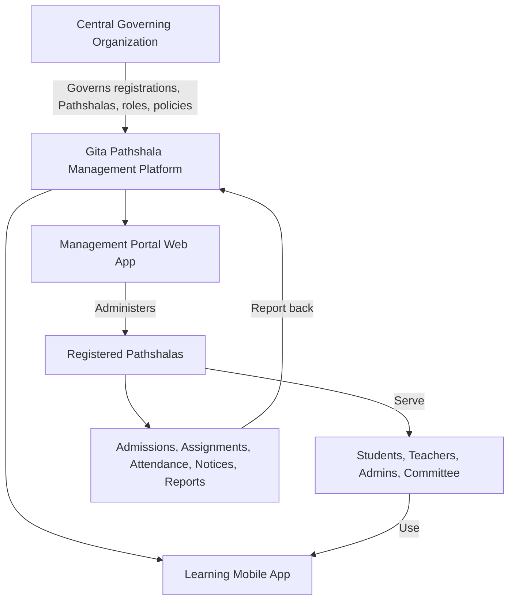
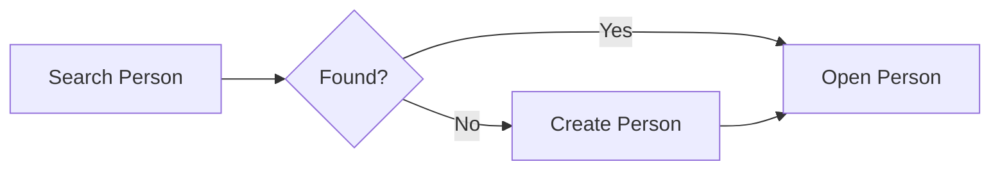
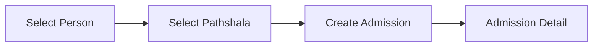
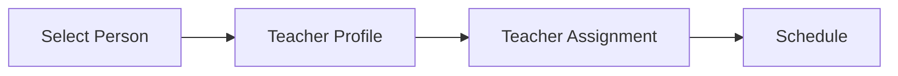
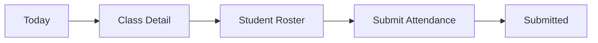

# Gita Pathshala Management Platform

# UI/UX Designer Guide by Application

**Document ID:** GP-UXD-007-A  
**Version:** 0.4  
**Date:** 2026-07-04  
**Audience:** UI/UX Designer  
**Reference:** GP-VAP-001 Product Vision & Architecture Principles

---

## 1. Product Context

The platform has two applications:

1. **Management Portal Web App**
2. **Learning Mobile App**

The web app should be designed first because it creates and manages the records that the mobile app uses.

This is a governed organizational platform. Users do not create open public accounts. Authorized users register people, create admissions or assignments, and activate accounts when needed.

High-level platform flow:

---

## 2. Decisions Already Made

The designer does not need to decide these again:

| Decision | Final Direction |
| --- | --- |
| Number of applications | Two: Management Portal and Learning App. |
| Public signup | Not allowed. |
| Account creation | Admin-controlled registration plus invitation or activation. |
| Person model | One person identity, many journeys. |
| Student flow | Person registration first, then student admission. |
| Teacher flow | Person registration first, then teacher profile, then assignment. |
| Portal users | Super Admin, Operations Member, Pathshala Admin, Committee Member. |
| App users | Teacher and Student. |
| Access control | Role + Permission + Scope. |

---

## 3. Design This First

The first design milestone should define authentication and the application shells.

| Priority | Screen / Flow | What to Design | Why It Comes First |
| --- | --- | --- | --- |
| 1 | Login | Existing user login only, no signup. | This is the entry point for approved users. |
| 2 | Account Activation | Invited user sets password or activates access. | This is how approved users get access. |
| 3 | Forgot / Reset Password | Recovery for existing accounts. | Required for real users. |
| 4 | Unauthorized / No Access | User has no permission or no active scope. | Required for governed access. |
| 5 | Management Portal Shell | Sidebar/topbar, scope selector, profile menu, role-aware navigation. | All portal screens depend on this structure. |
| 6 | Learning App Shell | Today, Schedule, Attendance, Notices, Profile tabs. | All mobile screens depend on this structure. |

---

## 4. Then Design These Core Workflows

After authentication and shells are clear, design the core workflows in this order:

| Order | Workflow | Key Screens |
| --- | --- | --- |
| 1 | Person Registry | Search Person, Create Person, Person Detail, Possible Duplicate Warning |
| 2 | Pathshala Registry | Pathshala List, Pathshala Detail, Assigned Admins |
| 3 | Student Admission | Select Person, Create Admission, Admission Detail, Transfer / Complete / Withdraw |
| 4 | Teacher Profile | Select Person, Create Teacher Profile, Teacher Detail |
| 5 | Teacher Assignment | Create Assignment, Schedule, Conflict Warning, Assignment Detail |
| 6 | Attendance | Session List, Take Attendance, Submit Attendance, Correction State |
| 7 | Notices | Create Notice, Audience Selection, Preview, Published Notice |
| 8 | Reports | Attendance Report, Pathshala Status Report, Student / Teacher Summary |

---

# Part A: Management Portal Web App

## 5. Web App Purpose

The Management Portal is for administration, governance, and operations.

Main users:

| User | Main Work |
| --- | --- |
| Super Admin | Manage the whole platform. |
| Operations Member | Support registries, monitoring, and reports. |
| Pathshala Admin | Manage one or more assigned Pathshalas. |
| Committee Member | Review reports and operational status. |

The web app should feel professional, structured, and efficient.

---

## 6. Web App Navigation

Recommended sections:

| Section | Purpose |
| --- | --- |
| Dashboard | Show current status and pending actions. |
| People | Register and manage person records. |
| Pathshalas | Manage registered Pathshalas. |
| Admissions | Admit registered people as students. |
| Teachers | Manage teacher profiles and assignments. |
| Attendance | Review sessions and attendance records. |
| Notices | Publish notices to selected audiences. |
| Reports | Review operational and governance data. |
| Access Control | Manage users, roles, permissions, and scopes. |

Portal shell should include:

| Element | Purpose |
| --- | --- |
| Sidebar | Main navigation. |
| Top bar | Search, notifications, user menu. |
| Scope selector | Shows current organization or Pathshala context. |
| Page actions | Main action for the current page. |

---

## 7. Web App Design Order

Design these first:

| Order | Area | Screens |
| --- | --- | --- |
| 1 | Authentication | Login, Account Activation, Forgot Password, Reset Password, No Access |
| 2 | Portal Shell | Sidebar, top bar, scope selector, user menu |
| 3 | Dashboard | Organization dashboard, Pathshala dashboard |
| 4 | People | Person search, create person, person detail |
| 5 | Pathshalas | Pathshala list, create Pathshala, Pathshala detail |
| 6 | Admissions | Create admission, admission detail, transfer/completion/withdrawal |
| 7 | Teachers | Teacher profile, teacher assignment, schedule |
| 8 | Attendance | Attendance sessions, session detail, review/correction |
| 9 | Notices | Create notice, audience selection, preview |
| 10 | Reports | Attendance, Pathshala status, student/teacher reports |
| 11 | Access Control | Users, roles, permissions, scope, audit log |

---

## 8. Important Web App Flows

### 8.1 Authentication

Use this model:

| Screen | Purpose |
| --- | --- |
| Login | Existing users sign in. |
| Account Activation | Approved users activate account access. |
| Forgot / Reset Password | Existing users recover access. |
| No Access | User is signed in but does not have permission or scope. |

Recommended login helper text:

> Access is provided by your Gita Pathshala administrator.

### 8.2 Person Registration

Design flow:

Reason: one person can later become student, teacher, admin, or committee member.

### 8.3 Student Admission

Design flow:

Reason: registration is not admission. Admission connects a registered person to a Pathshala.

### 8.4 Teacher Profile and Assignment

Design flow:

Reason: teacher profile describes the person. Assignment defines where and when they teach.

---

# Part B: Learning Mobile App

## 9. Mobile App Purpose

The Learning App is for daily use by teachers and students.

Main users:

| User | Main Work |
| --- | --- |
| Teacher | See today's classes, take attendance, read notices. |
| Student | See schedule, notices, profile, and attendance if allowed. |

The mobile app should feel simple, fast, and focused on today's work.

---

## 10. Mobile App Navigation

Recommended tabs:

| Tab | Teacher View | Student View |
| --- | --- | --- |
| Today | Today's classes and pending attendance | Today's schedule |
| Schedule | Teaching schedule | Class schedule |
| Attendance | Take/review attendance | View own attendance if allowed |
| Notices | Teacher notices | Student notices |
| Profile | Teacher profile and assignments | Student profile and admission |

---

## 11. Mobile App Design Order

Design these after the main web app structure is clear:

| Order | Area | Screens |
| --- | --- | --- |
| 1 | Mobile Auth | Login, activation, forgot/reset password |
| 2 | App Shell | Bottom tabs, header, profile access |
| 3 | Teacher Today | Today's classes, pending attendance |
| 4 | Take Attendance | Class detail, student roster, submit attendance |
| 5 | Teacher Schedule | Weekly teaching schedule |
| 6 | Student Today | Today's class and notices |
| 7 | Student Schedule | Weekly class schedule |
| 8 | Notices | Notice list and detail |
| 9 | Profile | Teacher/student profile view |

---

## 12. Important Mobile Flows

### 12.1 Teacher Attendance

Design notes:

| Element | Purpose |
| --- | --- |
| Class header | Show Pathshala, class, date, and time. |
| Student roster | Show students for that session. |
| Attendance status | Present, absent, late, excused if supported. |
| Submit confirmation | Confirm before final submission. |

### 12.2 Student Today

Design notes:

| Element | Purpose |
| --- | --- |
| Today's class | Show current class schedule. |
| Notices | Show relevant notices. |
| Profile shortcut | Let student view own information. |
| Attendance summary | Show only if policy allows. |

---

## 13. Shared Design Rules

Use these rules for both applications:

| Rule | Meaning |
| --- | --- |
| Use clear domain words | Person, Pathshala, Admission, Teacher Profile, Teacher Assignment, Attendance. |
| Show scope | Portal users should know which Pathshala or organization view they are using. |
| Search before create | Person workflows should begin with search. |
| Keep history visible | Transfer, completion, withdrawal, and assignment end are lifecycle actions. |
| Design all states | Include loading, empty, error, no access, validation, and success states. |
| Keep web efficient | Tables, filters, detail pages, and clear actions. |
| Keep mobile simple | Today-first, few taps, no admin complexity. |

---

## 14. First Design Milestone

Deliver these first:

| Deliverable | Screens |
| --- | --- |
| Web authentication | Login, activation, forgot/reset, no access |
| Web shell | Sidebar, top bar, scope selector |
| Web dashboard | Organization and Pathshala dashboard |
| Person workflow | Search person, create person, person detail |
| Mobile shell | Bottom tabs and app header |
| Mobile first screens | Teacher Today and Student Today |
| Basic components | Buttons, inputs, table, cards, status labels, modals |

---

## 15. Design Review Checklist

Before development, each screen should answer:

| Question | Needed |
| --- | --- |
| Which application is this for? | Web or mobile |
| Which user is this for? | Role clearly defined |
| What scope is active? | Organization, Pathshala, or self |
| What is the main action? | Clear primary action |
| What happens when there is no data? | Empty state |
| What happens when access is not allowed? | No access state |
| What errors can happen? | Error and validation states |
| What should developers build? | Clear handoff notes |
