# Gita Pathshala Management Platform

# UI/UX Designer Guidelines and Screen Design Brief

**Document ID:** GP-UXD-007  
**Version:** 0.1  
**Status:** Draft  
**Document Type:** UI/UX Design Brief and Designer Implementation Guide  
**Prepared For:** UI/UX Designer, Product Owner, Engineering Team  
**Prepared By:** Product Management and Enterprise Architecture  
**Date:** 2026-07-04  

**Header:** GP-UXD-007 | UI/UX Designer Guidelines | Version 0.1  
**Footer:** Confidential Project Documentation | Gita Pathshala Management Platform

---

## Document Control

| Attribute | Value |
| --- | --- |
| Document ID | GP-UXD-007 |
| Document Title | UI/UX Designer Guidelines and Screen Design Brief |
| Version | 0.1 |
| Status | Draft |
| Owner | Product Management and Enterprise Architecture |
| Primary Audience | UI/UX Designer, Product Manager, Frontend Developers, Flutter Developers, Backend Developers, QA Engineers |
| Source Foundation | GP-VAP-001 Product Vision & Architecture Principles |
| Related Documents | GP-DOM-003 Domain Model; GP-SRS-004 Software Requirements Specification; GP-API-006 API Specification |
| Approval Authority | Product Owner and Central Governing Organization |

---

## Revision History

| Version | Date | Author | Description |
| --- | --- | --- | --- |
| 0.1 | 2026-07-04 | Product Management and Enterprise Architecture | Initial UI/UX guideline document correcting authentication assumptions, defining screen inventory, role flows, and design rationale. |

---

## Table of Contents

0. Designer Quick Start and Work Order  
1. Purpose and Immediate Correction  
2. Product UX Principles  
3. User Types and Work Contexts  
4. Authentication and Account Activation UX  
5. Management Portal Information Architecture  
6. Management Portal Screen Guidelines  
7. Learning App Information Architecture  
8. Learning App Screen Guidelines  
9. Core Workflow UX Models  
10. Design System Guidelines  
11. Designer Delivery Requirements  
12. UX Acceptance Checklist  

---

## 0. Designer Quick Start and Work Order

### 0.1 Read This First

This document is written for the UI/UX designer. The architecture document explains the system deeply, but a designer needs a clearer answer to:

1. What is wrong with the current direction?
2. What decisions are already fixed?
3. What should be designed first?
4. What should be designed next?
5. What should not be designed at all?

The most important correction is simple:

> This is not a public signup product. Users do not join by creating their own accounts. Authorized admins register people, assign roles or journeys, and then activate accounts where needed.

### 0.2 Stop Doing These Immediately

| Stop | Why |
| --- | --- |
| Do not design public signup. | Normal users cannot create their own accounts. |
| Do not let users choose Student, Teacher, Admin, or Committee Member during signup. | Roles are assigned by the organization. |
| Do not design "Join a Pathshala" as a public flow. | Pathshala membership comes from admission or assignment. |
| Do not treat Student and Teacher as separate identity types. | One person can have many journeys. |
| Do not design only authentication and stop there. | The product is an operating platform, not a login screen. |

### 0.3 Decisions Already Made

The designer does not need to decide these again:

| Decision | Final Direction |
| --- | --- |
| Number of applications | Two: Management Portal and Learning App. |
| Public signup | Not allowed. |
| Account creation | Admin-controlled registration plus invitation or activation. |
| Person model | One person identity, many journeys. |
| Student flow | Person registration first, then student admission. |
| Teacher flow | Person registration first, then teacher profile, then assignment. |
| Portal users | Super Admin, Operations Member, Pathshala Admin, Committee Member. |
| App users | Teacher and Student. |
| Access control | Role + Permission + Scope. |

### 0.4 Design This First

The first design milestone should correct the authentication direction and define the product shell.

| Priority | Screen / Flow | What to Design | Why It Comes First |
| --- | --- | --- | --- |
| 1 | Login | Existing user login only, no signup. | Current design assumption is wrong and must be corrected before development continues. |
| 2 | Account Activation | Invited user sets password or activates access. | This replaces signup. |
| 3 | Forgot / Reset Password | Recovery for existing accounts. | Required for real users. |
| 4 | Unauthorized / No Access | User has no permission or no active scope. | Required for governed access. |
| 5 | Management Portal Shell | Sidebar/topbar, scope selector, profile menu, role-aware navigation. | All portal screens depend on this structure. |
| 6 | Learning App Shell | Today, Schedule, Attendance, Notices, Profile tabs. | All mobile screens depend on this structure. |

### 0.5 Then Design These Core Workflows

After authentication and shells are approved, design the core workflows in this order:

| Order | Workflow | Key Screens |
| --- | --- | --- |
| 1 | Person Registry | Search Person, Create Person, Person Detail, Possible Duplicate Warning |
| 2 | Pathshala Registry | Pathshala List, Pathshala Detail, Assigned Admins |
| 3 | Student Admission | Select Person, Create Admission, Admission Detail, Transfer / Complete / Withdraw |
| 4 | Teacher Profile | Select Person, Create Teacher Profile, Teacher Detail |
| 5 | Teacher Assignment | Create Assignment, Schedule, Conflict Warning, Assignment Detail |
| 6 | Attendance | Session List, Take Attendance, Submit Attendance, Correction State |
| 7 | Notices | Create Notice, Audience Selection, Preview, Published Notice |
| 8 | Reports | Attendance Report, Pathshala Status Report, Student / Teacher Summary |

### 0.6 First 10 Screens to Produce

If the designer needs a concrete starting list, produce these first:

| Number | Screen | Application |
| --- | --- | --- |
| 1 | Login | Both / shared auth |
| 2 | Account Activation | Both / shared auth |
| 3 | Forgot Password | Both / shared auth |
| 4 | Unauthorized / No Access | Both / shared auth |
| 5 | Management Portal Dashboard | Management Portal |
| 6 | Management Portal Shell with Scope Selector | Management Portal |
| 7 | Person Search / Person Registry List | Management Portal |
| 8 | Person Detail | Management Portal |
| 9 | Learning App Today Screen for Teacher | Learning App |
| 10 | Learning App Today Screen for Student | Learning App |

### 0.7 What "Good" Looks Like

| Good Design Behavior | Example |
| --- | --- |
| The UI prevents wrong assumptions. | No "Create Account" button on login. |
| The UI teaches the domain through flow. | Admission starts with finding a person. |
| The UI shows scope. | Pathshala Admin sees which Pathshala they are managing. |
| The UI supports real work. | Teacher opens app and immediately sees today's classes. |
| The UI preserves history. | Transfer is a separate action, not an overwritten Pathshala field. |

### 0.8 Simple Rule for Design Decisions

When unsure, ask:

> Is this a public user action, or an organization-governed action?

If it affects identity, role, Pathshala membership, admission, teacher assignment, attendance submission, or reporting, it is organization-governed and must not be treated like open self-service.

---

## 1. Purpose and Immediate Correction

### 1.1 High-Level Diagram

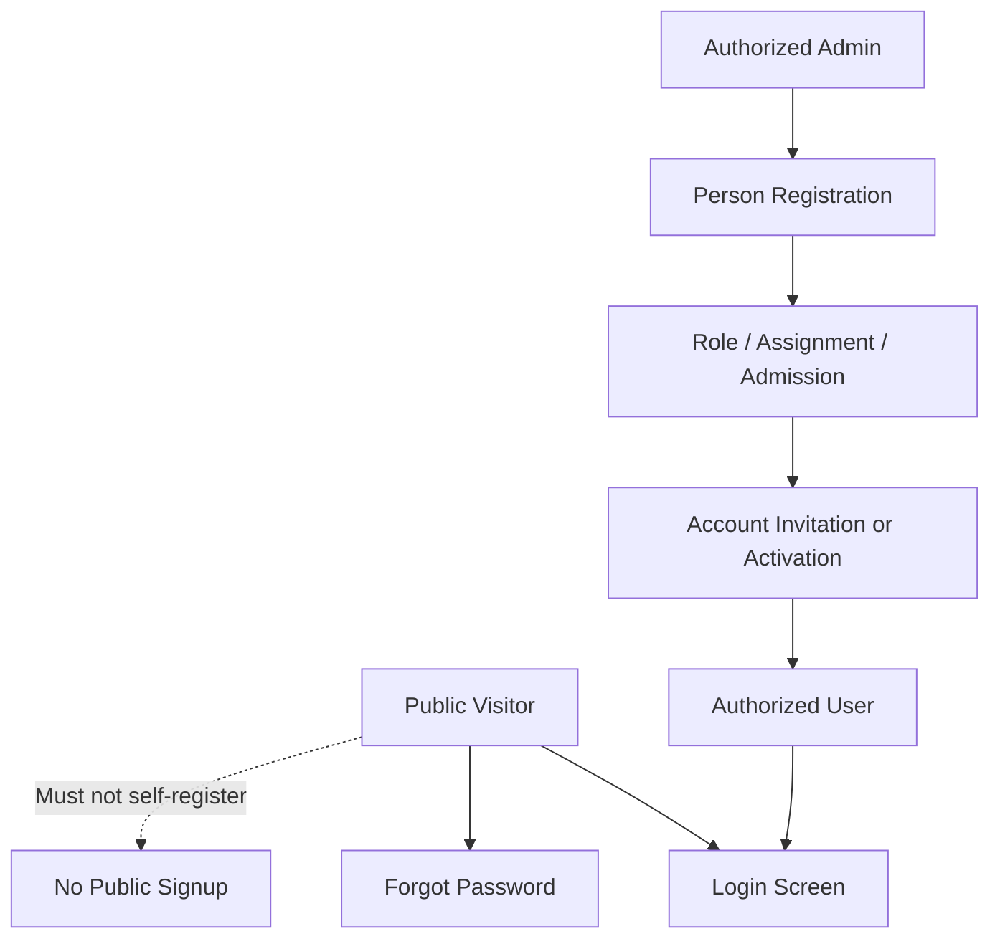

**Figure 1:** Correct authentication and account activation concept.

### 1.2 Explanation

This document gives the UI/UX designer clear product rules, screen guidance, and design rationale for the Gita Pathshala Management Platform. It corrects an important misunderstanding in the current design direction: **normal users cannot sign up by themselves.**

The platform is not a public consumer application where any visitor creates an account and joins. It is a governed organizational platform. People are registered through authorized workflows. Roles, admissions, teacher profiles, teacher assignments, and user accounts are created or activated only under governance rules.

The login page may be public, but the ecosystem is not open registration. A public signup screen would violate the product architecture because it allows uncontrolled identity creation and weakens central governance. The platform must know who a person is, which Pathshala they belong to, what journey they are part of, and what scope they are authorized to access.

The designer must therefore remove or redesign any screen that implies open self-signup. The correct UX pattern is:

| Incorrect UX | Correct UX |
| --- | --- |
| Public visitor clicks "Sign Up" and creates an account. | Authorized admin registers a person or selects an existing person. |
| User chooses their own role during signup. | Role, admission, assignment, or committee responsibility is assigned by authorized users. |
| User joins any Pathshala from public UI. | Pathshala association is created through admission or assignment workflows. |
| Student account exists because the student signed up. | Student identity exists because a person was registered and admitted. |
| Teacher account exists because the teacher signed up. | Teacher access exists because a person has teacher profile and assignment. |

The correct authentication experience should include:

| Screen | Required? | Purpose |
| --- | --- | --- |
| Login | Yes | Allow existing authorized users to access the correct application. |
| Forgot Password | Yes | Allow existing users to recover access. |
| Account Activation | Yes | Allow invited or provisioned users to set password or activate access. |
| Public Signup | No | Must not exist in the governed product. |
| Request Access | Optional, carefully controlled | Can collect interest or support request, but must not create a user account or person record automatically. |

### 1.3 Business Rules

| Rule ID | Business Rule |
| --- | --- |
| UX-BR-1.1 | The platform shall not provide open public self-signup. |
| UX-BR-1.2 | Person registration shall be performed by authorized users only. |
| UX-BR-1.3 | User account activation shall happen only after a person exists and access has been approved or assigned. |
| UX-BR-1.4 | Users shall not choose their own system role from a public interface. |
| UX-BR-1.5 | Pathshala membership, student admission, teacher assignment, and committee responsibility shall be created through governed workflows. |
| UX-BR-1.6 | Authentication screens shall clearly support existing users, invited users, and access recovery. |

### 1.4 Design Decisions

| Decision ID | Decision | Why This Exists |
| --- | --- | --- |
| UX-DD-1.1 | Remove public signup from the product UX. | Open signup breaks central governance and allows unverified identities into the ecosystem. |
| UX-DD-1.2 | Use invitation or activation instead of signup. | The system must first know who the person is and why they are allowed to access the platform. |
| UX-DD-1.3 | Separate authentication from person registration. | Login access is not the same as being a registered human in the organization. |
| UX-DD-1.4 | Design screens around governed workflows. | The platform reflects organizational operations, not consumer-style account creation. |

### 1.5 Notes

If an external visitor needs access, the UI may provide a "Contact administrator" or "Request help" pattern. That pattern must not create a person record, user account, role, or Pathshala membership automatically.

### 1.6 Open Questions

| Question ID | Open Question |
| --- | --- |
| UX-OQ-1.1 | Should the login page include a "Contact administrator" link for people who believe they should already have access? |
| UX-OQ-1.2 | Should account activation be email-based, phone-based, admin-generated, or support multiple methods? |

---

## 2. Product UX Principles

### 2.1 High-Level Diagram

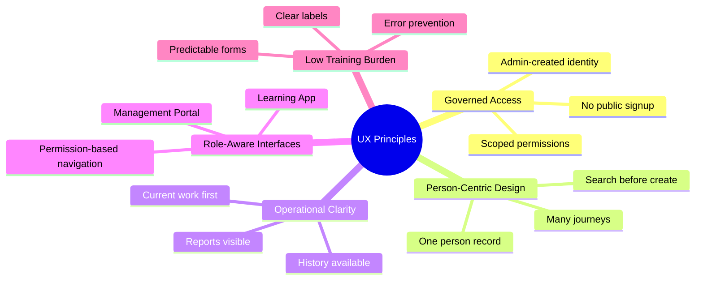

**Figure 2:** Product UX principles.

### 2.2 Explanation

The user experience must follow the product architecture defined in GP-VAP-001. The platform is person-centric, governed, and operational. The UI must make those ideas visible through screens, flows, labels, navigation, and states.

The designer should not start from generic school-management templates or consumer app patterns. Gita Pathshala operations have a specific governance model:

| Principle | UX Meaning |
| --- | --- |
| Govern Centrally. Operate Locally. | Central users see governance and reporting; Pathshala users see local operations within assigned scope. |
| One Person. One Identity. Many Journeys. | Screens must search for an existing person before creating a new person. |
| Registration is Not Admission. | Person registration and student admission are separate flows. |
| Teacher Profile is Not Teacher Assignment. | Teacher profile screens and teaching schedule assignment screens are separate. |
| Registries Store Truth. Operational Records Store Activities. | Registry management screens should feel different from daily operation screens. |
| History Should Never Be Destroyed. | Screens should show status, effective dates, and history instead of only overwriting current fields. |

The UI should reduce operational mistakes. For example, a Pathshala Admin admitting a student should not be asked to create a random "student account" first. The correct flow is to find or register a person, then admit that person to the selected Pathshala.

### 2.3 Business Rules

| Rule ID | Business Rule |
| --- | --- |
| UX-BR-2.1 | UI labels shall use domain language consistently: Person, Admission, Teacher Profile, Teacher Assignment, Pathshala, Attendance Session. |
| UX-BR-2.2 | Screens shall distinguish registry data from operational records. |
| UX-BR-2.3 | Navigation shall adapt to effective permissions and scope. |
| UX-BR-2.4 | Forms shall prevent common governance mistakes before submission. |
| UX-BR-2.5 | History and status shall be visible where operational records change over time. |

### 2.4 Design Decisions

| Decision ID | Decision | Why This Exists |
| --- | --- | --- |
| UX-DD-2.1 | Use domain-specific UX instead of generic school app UX. | The platform supports a federated religious and educational organization, not a single independent school. |
| UX-DD-2.2 | Make "search before create" a standard pattern for person workflows. | This reduces duplicate person records across Pathshalas. |
| UX-DD-2.3 | Use role-aware navigation instead of separate designs for every role. | The product has two applications and multiple roles; permission-aware navigation keeps the experience scalable. |
| UX-DD-2.4 | Show lifecycle status in operational screens. | Admissions and assignments are time-based records, so status and history matter. |

### 2.5 Notes

The designer should annotate major screens with the relevant product reason. For example, the admission screen should explicitly note: "This screen admits an existing person to a Pathshala; it does not create a new identity."

### 2.6 Open Questions

| Question ID | Open Question |
| --- | --- |
| UX-OQ-2.1 | Should the UI use the term "Pathshala" everywhere, or should some user-facing labels include local language variants? |
| UX-OQ-2.2 | Should the product support dark mode in the first release, or should design focus on one polished light theme? |

---

## 3. User Types and Work Contexts

### 3.1 High-Level Diagram

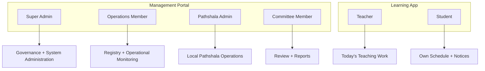

**Figure 3:** User types and primary work contexts.

### 3.2 Explanation

The platform has many roles, but only two application contexts. The Management Portal is for governance, administration, reporting, and monitoring. The Learning App is for daily teacher and student work.

The designer should avoid designing every role as a separate product. Instead, design shared application shells with role-aware navigation and data visibility.

| User Type | Application | Primary UX Need | What They Should Not See |
| --- | --- | --- | --- |
| Super Admin | Management Portal | Full governance, registries, roles, system oversight | Student-style daily learning UI as primary experience |
| Operations Member | Management Portal | Operational monitoring, registry support, reporting | Unauthorized system configuration |
| Pathshala Admin | Management Portal | Manage assigned Pathshala operations | Other Pathshalas outside scope |
| Committee Member | Management Portal | Review reports, monitor status, governance insight | Mutation workflows unless explicitly permitted |
| Teacher | Learning App | Today's classes, attendance, notices, profile | Central registry administration |
| Student | Learning App | Own schedule, notices, attendance view, profile | Teacher/admin workflows |

Each role should have a clear landing page. A role's landing page should answer: "What requires my attention now?"

### 3.3 Business Rules

| Rule ID | Business Rule |
| --- | --- |
| UX-BR-3.1 | Super Admin, Operations Member, Pathshala Admin, and Committee Member shall use the Management Portal. |
| UX-BR-3.2 | Teacher and Student shall use the Learning App. |
| UX-BR-3.3 | A user's visible navigation shall be determined by effective permissions. |
| UX-BR-3.4 | A user's visible data shall be limited by scope. |
| UX-BR-3.5 | Users with multiple roles shall be able to understand which role or scope they are currently acting under. |

### 3.4 Design Decisions

| Decision ID | Decision | Why This Exists |
| --- | --- | --- |
| UX-DD-3.1 | Use two application shells rather than role-specific apps. | This matches the approved architecture and keeps the product maintainable. |
| UX-DD-3.2 | Design dashboards around work context. | Users need their most relevant decisions and tasks first, not generic metrics. |
| UX-DD-3.3 | Show current scope in the Management Portal. | Scoped access is central to governance; users must know which Pathshala or organizational scope they are viewing. |

### 3.5 Notes

For multi-role users, the UI may include a role/scope switcher. This should not grant access by itself. It only changes the active context among scopes already authorized by backend permissions.

### 3.6 Open Questions

| Question ID | Open Question |
| --- | --- |
| UX-OQ-3.1 | Should multi-role users choose a role at login, or should the portal open with a combined dashboard? |
| UX-OQ-3.2 | Should Committee Members have read-only access by default? |

---

## 4. Authentication and Account Activation UX

### 4.1 High-Level Diagram

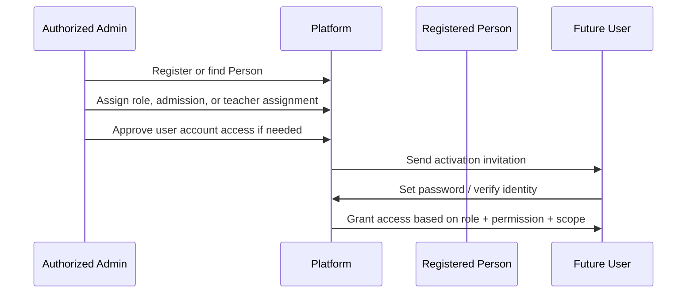

**Figure 4:** Account activation flow.

### 4.2 Explanation

Authentication UX must support a governed account lifecycle. The login page is for existing users. The activation page is for users who have already been registered or approved. The forgot password page is for account recovery. There is no public user signup.

The designer should produce the following authentication screens:

| Screen | Primary Content | Required Actions | Notes |
| --- | --- | --- | --- |
| Login | Product name, login identifier, password, forgot password | Sign in | No public signup button. |
| Account Activation | Invitation validation, password setup, confirmation | Activate account | User cannot choose role or Pathshala. |
| Forgot Password | Login identifier, recovery instructions | Send recovery instructions | Only works for existing accounts. |
| Reset Password | Secure token validation, new password | Reset password | Should include expired token state. |
| Access Help | Contact administrator or support guidance | Submit help request or view instructions | Must not create account automatically. |
| Unauthorized / No Scope | Clear denied access message | Return, contact admin | Avoid exposing protected data. |

The login page may include a short explanatory line such as: "Access is provided by your Gita Pathshala administrator." This line sets correct expectations without becoming a marketing page.

The account activation page should not ask the user to select whether they are a student, teacher, admin, or committee member. Those are governed relationships already created in the system.

### 4.3 Business Rules

| Rule ID | Business Rule |
| --- | --- |
| UX-BR-4.1 | Login shall be available only for existing authorized accounts. |
| UX-BR-4.2 | Account activation shall require a valid invitation, token, or administrator-provided activation method. |
| UX-BR-4.3 | Account activation shall not allow users to select their own role or scope. |
| UX-BR-4.4 | Forgot password shall not reveal whether a sensitive identity exists beyond safe recovery messaging. |
| UX-BR-4.5 | Unauthorized states shall guide the user without exposing protected records. |

### 4.4 Design Decisions

| Decision ID | Decision | Why This Exists |
| --- | --- | --- |
| UX-DD-4.1 | Replace "Sign Up" with "Activate Account" where appropriate. | Activation reflects governed access; signup implies uncontrolled entry. |
| UX-DD-4.2 | Add "Contact administrator" instead of self-registration. | Legitimate users who lack access need a support path, not a bypass. |
| UX-DD-4.3 | Avoid role selection in authentication screens. | Roles are assigned by governance workflows, not user preference. |
| UX-DD-4.4 | Include empty, expired, invalid, and unauthorized states. | Authentication flows fail often; polished failure states reduce confusion and support load. |

### 4.5 Notes

The designer should mark any existing signup design as rejected for this product. If a signup screen has already been designed or built, it should be removed from the primary user flow and replaced with account activation or access help.

### 4.6 Open Questions

| Question ID | Open Question |
| --- | --- |
| UX-OQ-4.1 | Will activation be sent through email, SMS, WhatsApp, printed code, or admin-provided temporary password? |
| UX-OQ-4.2 | Should students have login accounts in the first release, or should student app access be phased later? |

---

## 5. Management Portal Information Architecture

### 5.1 High-Level Diagram

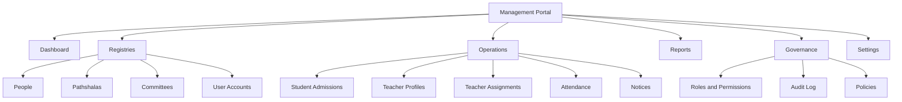

**Figure 5:** Management Portal information architecture.

### 5.2 Explanation

The Management Portal should be designed as an operational administration workspace. It should be clear, structured, and efficient. It should not look like a marketing site or student learning app.

The primary navigation should reflect platform domains:

| Navigation Area | Purpose | Typical Users |
| --- | --- | --- |
| Dashboard | Work summary, operational status, alerts | All portal users according to scope |
| Registries | Manage authoritative records | Super Admin, Operations Member |
| Operations | Manage admissions, assignments, attendance, notices | Operations Member, Pathshala Admin |
| Reports | Review governance and local performance | Super Admin, Operations Member, Committee Member, Pathshala Admin |
| Governance | Manage roles, permissions, audit, policies | Super Admin and approved governance users |
| Settings | Profile, preferences, organization configuration | Permission-dependent |

The portal must always make scope visible. For example, a Pathshala Admin should know they are managing "Pathshala A," not the whole organization. A Super Admin may need a global view with filters for region, Pathshala, status, or time period.

### 5.3 Business Rules

| Rule ID | Business Rule |
| --- | --- |
| UX-BR-5.1 | Portal navigation shall be permission-aware. |
| UX-BR-5.2 | Portal data views shall be scope-aware. |
| UX-BR-5.3 | Registry screens shall be separated from operational screens. |
| UX-BR-5.4 | Reports shall support central and local views according to permissions. |
| UX-BR-5.5 | Sensitive governance screens shall not appear to unauthorized users. |

### 5.4 Design Decisions

| Decision ID | Decision | Why This Exists |
| --- | --- | --- |
| UX-DD-5.1 | Use domain-based navigation. | Users and developers need navigation that matches the platform's domain model. |
| UX-DD-5.2 | Keep portal UI information-dense but readable. | Administrative work requires scanning, filtering, comparison, and repeated action. |
| UX-DD-5.3 | Include scope controls in the portal shell. | Scope is part of authorization and must be visible to prevent mistakes. |
| UX-DD-5.4 | Use tables for registry and operational lists. | Admin users need sorting, filtering, status, actions, and bulk review patterns. |

### 5.5 Notes

The portal should use compact page headers, clear primary actions, filters, status chips, and detail drawers or detail pages. Avoid oversized hero sections, decorative illustrations, and landing-page style layouts inside the application.

### 5.6 Open Questions

| Question ID | Open Question |
| --- | --- |
| UX-OQ-5.1 | Should the first portal version use a left sidebar, top navigation, or hybrid shell? |
| UX-OQ-5.2 | Which dashboard metrics are mandatory for launch? |

---

## 6. Management Portal Screen Guidelines

### 6.1 High-Level Diagram

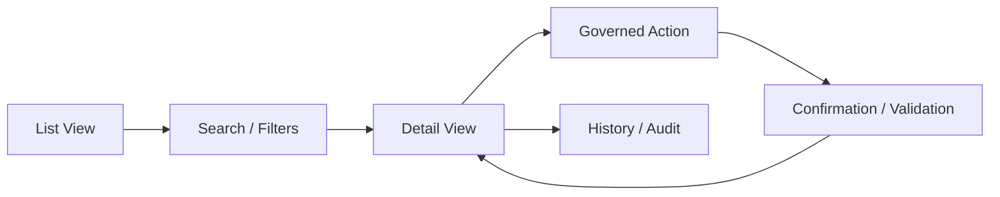

**Figure 6:** Standard portal screen interaction model.

### 6.2 Explanation

Most Management Portal modules should follow a predictable structure: list, search/filter, detail, action, confirmation, and history. This allows users to learn the platform once and apply the same behavior across people, Pathshalas, admissions, teachers, assignments, attendance, and notices.

The designer should produce screens for the following portal areas.

#### 6.2.1 Portal Dashboard

| Element | Guidance | Reason |
| --- | --- | --- |
| Current scope indicator | Show organization-wide or selected Pathshala scope. | Prevents users from acting in the wrong context. |
| Key operational cards | Active Pathshalas, active students, assigned teachers, attendance status, pending actions. | Gives leadership and admins immediate operational visibility. |
| Alerts / exceptions | Missing teacher assignments, low attendance, inactive Pathshalas, pending approvals. | Governance depends on exception management. |
| Recent activity | Show relevant recent changes by scope. | Helps users monitor operational movement. |

#### 6.2.2 Person Registry

| Element | Guidance | Reason |
| --- | --- | --- |
| Search first | Search by name, phone, email, date of birth, guardian where applicable. | Prevents duplicate person records. |
| Person detail | Show identity, contact, journeys, linked user account, history. | One person may have many journeys. |
| Create person | Use only after search does not find existing person. | Supports governed registration. |
| Duplicate warning | Show possible matches before save. | Protects registry quality. |

#### 6.2.3 Pathshala Registry

| Element | Guidance | Reason |
| --- | --- | --- |
| Pathshala list | Show name, location, status, admin, active students, active teachers. | Central users need operational overview. |
| Pathshala detail | Include profile, assigned admins, operating schedule, reports, history. | Pathshala is a governed organizational unit. |
| Create Pathshala | Restricted to authorized central users. | Local users should not create their own Pathshalas. |
| Status management | Active, inactive, pending, archived if needed. | Governance requires lifecycle control. |

#### 6.2.4 Student Admission

| Element | Guidance | Reason |
| --- | --- | --- |
| Person selection | Start by finding or registering a person. | Admission is not identity creation. |
| Pathshala context | Default to active Pathshala scope for local admins. | Reduces mistakes and respects scope. |
| Admission details | Admission date, class/group, status, notes, guardian if applicable. | Operational record must be clear. |
| Transfer action | Separate action, not field overwrite. | Preserves history. |
| Completion / withdrawal | Status transitions with reason and date. | Supports lifecycle and reporting. |

#### 6.2.5 Teacher Profile

| Element | Guidance | Reason |
| --- | --- | --- |
| Person selection | Search existing person before creating profile. | Teacher is a journey of a person. |
| Profile details | Skills, experience, contact visibility, status. | Describes teacher capability. |
| Assignment summary | Show active and past assignments. | Profile is not assignment, but should link to assignments. |
| Create assignment action | Separate action from profile edit. | Preserves model clarity. |

#### 6.2.6 Teacher Assignment

| Element | Guidance | Reason |
| --- | --- | --- |
| Teacher selector | Choose from approved teacher profiles. | Assignment requires a known teacher. |
| Pathshala selector | Scope-controlled. | Prevents assigning outside authority. |
| Class / group | Select teaching group or class. | Defines what is taught. |
| Schedule | Day, time, recurrence, effective dates. | Teacher may teach multiple schedules. |
| Conflict warning | Show overlapping assignments where possible. | Reduces operational errors. |

#### 6.2.7 Attendance Management

| Element | Guidance | Reason |
| --- | --- | --- |
| Session list | Show date, Pathshala, class, teacher, status. | Attendance belongs to sessions. |
| Attendance capture | Student list with present/absent/late/excused states if supported. | Fast daily operation. |
| Submission state | Draft, submitted, corrected if needed. | Supports accountability. |
| Correction flow | Require reason for sensitive changes. | History should not be destroyed. |

#### 6.2.8 Notices

| Element | Guidance | Reason |
| --- | --- | --- |
| Audience selector | Pathshala, class, teachers, students, committee, role-based if supported. | Notices must reach correct audience. |
| Publish status | Draft, scheduled, published, expired. | Communication has lifecycle. |
| Preview | Show how notice appears in app. | Prevents poor mobile experience. |
| Read status | Optional where needed. | Helps confirm communication reach. |

#### 6.2.9 Reports

| Element | Guidance | Reason |
| --- | --- | --- |
| Filters | Date range, Pathshala, class, status, role. | Reports must support governance review. |
| Summary and detail | Show high-level metrics with drill-down. | Different users need different levels. |
| Export | CSV/PDF if supported later. | Committees may need offline sharing. |
| Empty state | Explain when no data exists for selected filters. | Prevents confusion. |

#### 6.2.10 Roles, Permissions, and Audit

| Element | Guidance | Reason |
| --- | --- | --- |
| Role list | Show role name, description, users, scopes. | Admins need to understand access. |
| Permission matrix | Show permissions grouped by domain. | Reduces authorization mistakes. |
| Scope assignment | Organization, Pathshala, committee, self. | Scope is required for effective permission. |
| Override view | Show person-specific exceptions. | Exceptions must be auditable. |
| Audit log | Who, what, when, where, why. | Governance requires traceability. |

### 6.3 Business Rules

| Rule ID | Business Rule |
| --- | --- |
| UX-BR-6.1 | Portal forms shall show validation before destructive or sensitive actions are submitted. |
| UX-BR-6.2 | Portal detail screens shall show status and history for lifecycle records. |
| UX-BR-6.3 | Person-related workflows shall search before create. |
| UX-BR-6.4 | Admission and assignment screens shall not be merged into person profile editing. |
| UX-BR-6.5 | All restricted actions shall have disabled, hidden, or denied states aligned with authorization rules. |

### 6.4 Design Decisions

| Decision ID | Decision | Why This Exists |
| --- | --- | --- |
| UX-DD-6.1 | Standardize list-detail-action patterns. | Predictable patterns reduce training and implementation complexity. |
| UX-DD-6.2 | Use explicit lifecycle actions such as transfer, complete, withdraw, end assignment. | These are business events, not ordinary field edits. |
| UX-DD-6.3 | Show history near operational details. | Users need to understand current state in context. |
| UX-DD-6.4 | Design reports as governance tools. | Reports are not decorative dashboards; they support oversight and decisions. |

### 6.5 Notes

Each Figma screen should include notes for permission behavior, empty state, loading state, validation state, and mobile or responsive behavior where relevant.

### 6.6 Open Questions

| Question ID | Open Question |
| --- | --- |
| UX-OQ-6.1 | Which records need bulk actions in the first release? |
| UX-OQ-6.2 | Should detail pages use full pages, slide-over drawers, or both depending on complexity? |

---

## 7. Learning App Information Architecture

### 7.1 High-Level Diagram

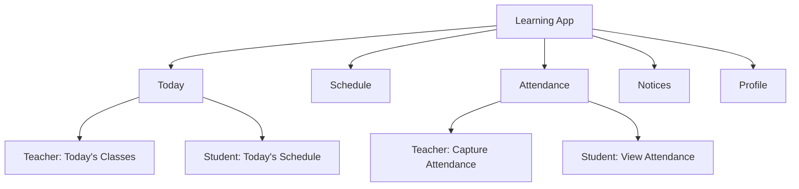

**Figure 7:** Learning App information architecture.

### 7.2 Explanation

The Learning App is for teachers and students. It should be mobile-first, task-focused, and simple. It should not expose central governance screens, registry management, role management, or broad reports.

The app should focus on "today's work":

| Area | Teacher Experience | Student Experience |
| --- | --- | --- |
| Today | Classes to teach, pending attendance, notices | Today's class schedule, notices |
| Schedule | Teaching schedule by day/week | Own schedule by day/week |
| Attendance | Capture attendance for assigned sessions | View own attendance if permitted |
| Notices | Read notices relevant to role, Pathshala, class | Read notices relevant to student |
| Profile | View own profile and assignments | View own profile and admission context |

Teacher and student experiences may share the same app shell but must be permission-aware. A teacher who is also a student or committee member must only see features supported by their authorized role and app context.

### 7.3 Business Rules

| Rule ID | Business Rule |
| --- | --- |
| UX-BR-7.1 | The Learning App shall not include central governance functions. |
| UX-BR-7.2 | Teachers shall see only assigned teaching work unless granted additional permissions. |
| UX-BR-7.3 | Students shall see only their own information unless future guardian/parent features are approved. |
| UX-BR-7.4 | The primary Learning App landing page shall prioritize today's work. |
| UX-BR-7.5 | Attendance capture shall be available only for authorized teacher assignments or sessions. |

### 7.4 Design Decisions

| Decision ID | Decision | Why This Exists |
| --- | --- | --- |
| UX-DD-7.1 | Use "Today" as the primary landing tab. | Teachers and students need immediate daily context. |
| UX-DD-7.2 | Keep app navigation shallow. | Mobile users should not navigate through administrative hierarchy. |
| UX-DD-7.3 | Reuse schedule and notice patterns for both teachers and students. | Shared patterns reduce complexity while content remains role-aware. |

### 7.5 Notes

The Learning App should use compact, accessible mobile components. Avoid dense administrative tables. Use cards or lists for daily tasks only where they support scanning and action.

### 7.6 Open Questions

| Question ID | Open Question |
| --- | --- |
| UX-OQ-7.1 | Should teacher attendance capture work offline for low-connectivity Pathshalas? |
| UX-OQ-7.2 | Should students receive push notifications for notices in the first release? |

---

## 8. Learning App Screen Guidelines

### 8.1 High-Level Diagram

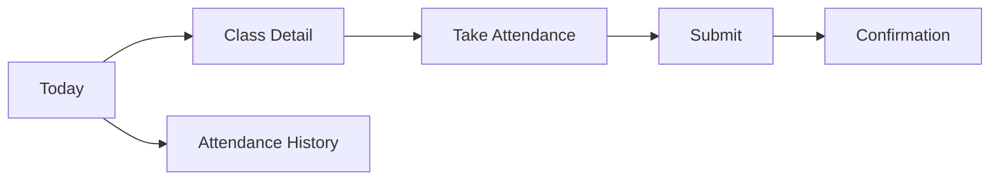

**Figure 8:** Teacher daily attendance flow.

### 8.2 Explanation

The Learning App should be designed around fast daily use. Teachers may be standing in class and need to take attendance quickly. Students may only need to check schedule and notices. The design must avoid administrative complexity.

#### 8.2.1 Login and Activation

| Element | Guidance | Reason |
| --- | --- | --- |
| Login | Same governed login rules as portal. | Existing users only. |
| Activation | Mobile-friendly activation flow. | Teachers/students may activate from phone. |
| No signup | Do not allow public account creation. | Protects governance model. |

#### 8.2.2 Teacher Today Screen

| Element | Guidance | Reason |
| --- | --- | --- |
| Today's classes | Show time, Pathshala, class/group, attendance status. | Teacher needs immediate work list. |
| Pending attendance | Highlight sessions needing action. | Reduces missed records. |
| Notice summary | Show recent relevant notices. | Keeps teacher informed. |
| Quick action | "Take attendance" for active/pending sessions. | Reduces friction. |

#### 8.2.3 Teacher Attendance Capture

| Element | Guidance | Reason |
| --- | --- | --- |
| Student roster | Show admitted students for that class/session. | Attendance is tied to valid admission context. |
| Attendance states | Present, absent, late, excused if approved. | Captures educational participation. |
| Save draft | Optional if session can be interrupted. | Supports real classroom use. |
| Submit | Clear confirmation before final submit. | Submitted attendance has governance value. |
| Correction request | Separate from ordinary edit after submission. | Preserves history. |

#### 8.2.4 Teacher Schedule

| Element | Guidance | Reason |
| --- | --- | --- |
| Week view | Show teaching assignments by day. | Teachers may have multiple assignments. |
| Class detail | Show class/group, Pathshala, time, location if available. | Reduces confusion across Pathshalas. |
| Empty state | "No classes assigned for this day." | Explains missing data without implying error. |

#### 8.2.5 Student Today Screen

| Element | Guidance | Reason |
| --- | --- | --- |
| Today's schedule | Show class time, subject/group if available, teacher if approved. | Student needs daily context. |
| Notices | Show relevant notices. | Students need communication. |
| Attendance summary | Optional according to policy. | Some organizations may expose attendance to students. |

#### 8.2.6 Student Profile

| Element | Guidance | Reason |
| --- | --- | --- |
| Person details | Show approved identity and contact information. | Student should understand registered profile. |
| Admission context | Show current Pathshala and class/group. | Admission is the student's current educational relationship. |
| History | Show only if permitted. | Historical visibility may be policy-controlled. |

### 8.3 Business Rules

| Rule ID | Business Rule |
| --- | --- |
| UX-BR-8.1 | Teacher attendance capture shall be accessible from assigned sessions only. |
| UX-BR-8.2 | Student app screens shall not expose other students' personal details. |
| UX-BR-8.3 | Submitted attendance shall use a correction workflow instead of unrestricted editing. |
| UX-BR-8.4 | Learning App screens shall be optimized for mobile use. |
| UX-BR-8.5 | Empty states shall clearly distinguish "no data assigned" from "system error." |

### 8.4 Design Decisions

| Decision ID | Decision | Why This Exists |
| --- | --- | --- |
| UX-DD-8.1 | Put attendance entry close to today's class list. | The teacher should not search through admin screens to perform daily work. |
| UX-DD-8.2 | Keep student UX self-service only. | Students should not access governance or operational administration. |
| UX-DD-8.3 | Treat submitted attendance as a governed record. | Attendance affects reports and must remain reliable. |

### 8.5 Notes

The designer should prepare mobile screen states for loading, offline or connection error, no assigned classes, attendance already submitted, and unauthorized session access.

### 8.6 Open Questions

| Question ID | Open Question |
| --- | --- |
| UX-OQ-8.1 | Should students be allowed to update any profile fields, or should changes require administrator review? |
| UX-OQ-8.2 | Should attendance capture include remarks per student in the first release? |

---

## 9. Core Workflow UX Models

### 9.1 High-Level Diagram

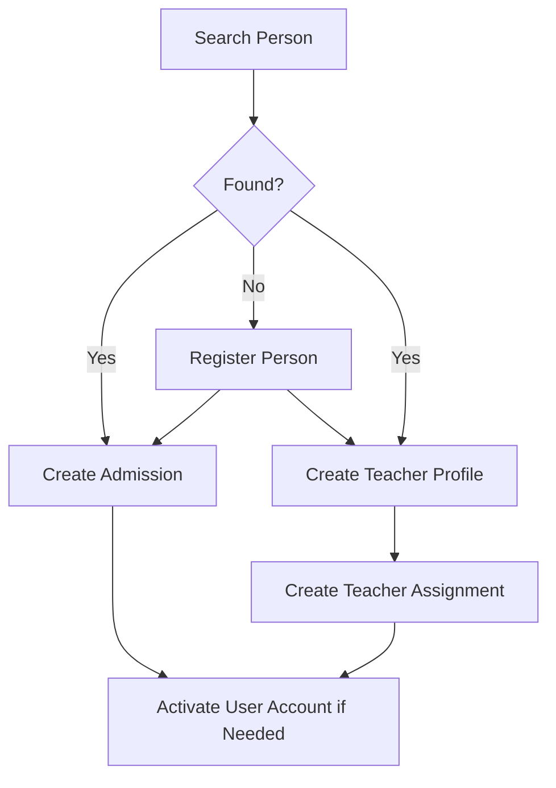

**Figure 9:** Search-before-create workflow model.

### 9.2 Explanation

The designer must use workflow models that protect the platform's architecture. The most important model is search-before-create. Whenever a user is about to admit a student, create a teacher profile, assign a role, or activate an account, the UI should help them find the person first.

#### 9.2.1 Person Registration Workflow

1. User opens Person Registry or starts a workflow that requires a person.
2. System asks the user to search first.
3. User reviews possible matches.
4. If no match exists, authorized user creates person.
5. System records person as a registry identity.
6. User continues to admission, teacher profile, role assignment, or account activation.

Why this exists: It prevents duplicate identities and supports the principle "One Person. One Identity. Many Journeys."

#### 9.2.2 Student Admission Workflow

1. User selects Pathshala scope.
2. User searches for an existing person.
3. User creates person only if no existing record matches.
4. User enters admission details.
5. System creates student admission record.
6. Student appears in local operational views.

Why this exists: Registration is not admission. Admission connects a person to a Pathshala.

#### 9.2.3 Teacher Assignment Workflow

1. User searches for existing person.
2. User confirms or creates teacher profile.
3. User creates assignment for Pathshala, class/group, day, time, and effective dates.
4. System checks scope and possible conflicts.
5. Assignment appears in teacher schedule and attendance workflows.

Why this exists: Teacher profile is not teacher assignment. A teacher can serve multiple Pathshalas and schedules.

#### 9.2.4 Transfer Workflow

1. User opens active admission.
2. User selects transfer action.
3. User enters transfer reason, date, and destination if known.
4. System closes or updates the previous admission lifecycle according to policy.
5. System creates or prepares new admission for destination Pathshala.
6. History remains visible.

Why this exists: Transfer is a lifecycle event, not an overwrite.

### 9.3 Business Rules

| Rule ID | Business Rule |
| --- | --- |
| UX-BR-9.1 | Workflows involving people shall require search before create. |
| UX-BR-9.2 | Admission creation shall require a person and Pathshala context. |
| UX-BR-9.3 | Teacher assignment creation shall require a teacher profile and Pathshala context. |
| UX-BR-9.4 | Transfer, completion, withdrawal, and assignment end shall be explicit actions. |
| UX-BR-9.5 | Account activation shall be downstream from identity and access approval. |

### 9.4 Design Decisions

| Decision ID | Decision | Why This Exists |
| --- | --- | --- |
| UX-DD-9.1 | Use guided flows for high-risk domain actions. | Admission, transfer, assignment, and account activation affect long-lived records. |
| UX-DD-9.2 | Use confirmation screens for lifecycle actions. | Users need to understand consequences before changing historical state. |
| UX-DD-9.3 | Keep workflow language aligned with domain terms. | Mislabeling flows causes incorrect implementation and user misunderstanding. |

### 9.5 Notes

The designer should include annotations in Figma for system behavior, validation, permission checks, and record lifecycle effects. These annotations help developers build the correct behavior instead of copying only visual layout.

### 9.6 Open Questions

| Question ID | Open Question |
| --- | --- |
| UX-OQ-9.1 | Should transfer be a single guided wizard or a two-step close-and-admit workflow? |
| UX-OQ-9.2 | Which workflows require approval before becoming active? |

---

## 10. Design System Guidelines

### 10.1 High-Level Diagram

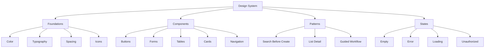

**Figure 10:** Design system structure.

### 10.2 Explanation

The designer should create a reusable design system, not disconnected screens. The platform will grow across modules, roles, and applications. Consistent components will reduce development time and improve usability.

The visual style should be professional, calm, and operational. The Management Portal should feel like a trusted administration tool. The Learning App can be warmer and simpler, but it should still feel reliable and connected to the same platform.

#### 10.2.1 Layout

| Area | Guidance | Reason |
| --- | --- | --- |
| Portal | Sidebar or structured navigation, compact headers, tables, filters, detail panels. | Supports repeated administrative work. |
| Learning App | Bottom navigation or simple tab structure, mobile-first lists and actions. | Supports fast daily use. |
| Responsive behavior | Define desktop, tablet, and mobile breakpoints where applicable. | Prevents layout failures during implementation. |

#### 10.2.2 Components

| Component | Required Variants |
| --- | --- |
| Buttons | Primary, secondary, destructive, icon, disabled, loading |
| Forms | Text input, select, date, time, phone, email, validation, required/optional indicators |
| Tables | Sorting, filtering, pagination, empty state, row actions, status chips |
| Cards | Dashboard metric, daily class item, notice item, summary card |
| Navigation | Portal sidebar/topbar, mobile bottom tabs, breadcrumbs where useful |
| Modals | Confirmation, destructive action, warning, simple form |
| Search | Person search, global search if approved, filter search |
| Status | Active, inactive, pending, submitted, draft, completed, transferred, withdrawn |

#### 10.2.3 States

Every screen must have state design:

| State | Required Design Behavior |
| --- | --- |
| Loading | Show skeleton or progress state without shifting layout excessively. |
| Empty | Explain why no data exists and what action is available. |
| Error | Explain the problem and recovery action. |
| Unauthorized | State that the user does not have access and provide safe next step. |
| Validation | Show field-level errors with clear correction guidance. |
| Success | Confirm completion and show next logical action. |

### 10.3 Business Rules

| Rule ID | Business Rule |
| --- | --- |
| UX-BR-10.1 | Design components shall be reusable across modules. |
| UX-BR-10.2 | All screens shall include empty, loading, error, and unauthorized states where applicable. |
| UX-BR-10.3 | Status labels shall be consistent across portal and app. |
| UX-BR-10.4 | Destructive or lifecycle-changing actions shall use confirmation patterns. |
| UX-BR-10.5 | The design system shall support accessibility basics including contrast, readable type, and keyboard-friendly portal components. |

### 10.4 Design Decisions

| Decision ID | Decision | Why This Exists |
| --- | --- | --- |
| UX-DD-10.1 | Build a design system before completing all screens. | A reusable system prevents inconsistent implementation as the product grows. |
| UX-DD-10.2 | Use operational visual language for the portal. | Portal users need efficient management, not promotional design. |
| UX-DD-10.3 | Use mobile-first task design for the Learning App. | Teachers and students need quick daily actions on phones. |
| UX-DD-10.4 | Include state design as part of screen completion. | Screens are incomplete without loading, error, empty, and access states. |

### 10.5 Notes

The designer should create Figma components with clear names that match implementation concepts. Example: `PersonSearchField`, `ScopeSelector`, `StatusChip`, `AttendanceStateControl`, `LifecycleActionModal`.

### 10.6 Open Questions

| Question ID | Open Question |
| --- | --- |
| UX-OQ-10.1 | Is there an existing brand guide, logo, or color standard for the organization? |
| UX-OQ-10.2 | Should the design system support Bengali or Sanskrit text in the first version? |

---

## 11. Designer Delivery Requirements

### 11.1 High-Level Diagram

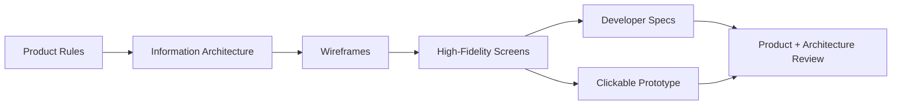

**Figure 11:** Designer delivery workflow.

### 11.2 Explanation

The designer should not continue designing isolated screens without validating the workflow and product assumptions. The required design delivery should move from product rules to information architecture, wireframes, high-fidelity screens, prototype, and developer specs.

Required deliverables:

| Deliverable | Required Content |
| --- | --- |
| IA map | Management Portal and Learning App navigation with role visibility notes. |
| Auth flow | Login, activation, forgot password, reset password, access help, unauthorized states. |
| Portal wireframes | Dashboard, registries, admissions, teachers, assignments, attendance, notices, reports, roles/permissions. |
| Learning App wireframes | Today, schedule, attendance, notices, profile for teacher and student contexts. |
| High-fidelity screens | Approved visual design for priority workflows. |
| Component library | Buttons, forms, tables, navigation, cards, status chips, modals, search components. |
| Interaction notes | Validation, confirmation, empty states, loading states, permission behavior. |
| Prototype | Clickable critical flows for review. |
| Developer handoff | Measurements, spacing, components, states, responsive behavior, and annotations. |

The designer must include reasoning notes for the major flows. For example, the authentication design should explicitly state: "There is no signup because access is governed. Users activate accounts only after being registered and authorized."

### 11.3 Business Rules

| Rule ID | Business Rule |
| --- | --- |
| UX-BR-11.1 | No screen shall be considered final without state designs and permission notes. |
| UX-BR-11.2 | Critical workflows shall be reviewed before visual polish is finalized. |
| UX-BR-11.3 | Developer handoff shall include component names, spacing, behavior, and validation rules. |
| UX-BR-11.4 | Figma files shall separate Management Portal, Learning App, components, and flow diagrams. |
| UX-BR-11.5 | Screens that contradict GP-VAP-001 shall be revised before development continues. |

### 11.4 Design Decisions

| Decision ID | Decision | Why This Exists |
| --- | --- | --- |
| UX-DD-11.1 | Require product reasoning in design annotations. | The team needs to understand why screens behave a certain way, not only how they look. |
| UX-DD-11.2 | Review wireframes before high-fidelity expansion. | This prevents polishing incorrect product flows. |
| UX-DD-11.3 | Treat developer handoff as part of design completion. | The design must be implementable and testable. |

### 11.5 Notes

The current authentication design should be revised immediately if it includes public signup. Development should pause on that flow until the corrected authentication and activation model is approved.

### 11.6 Open Questions

| Question ID | Open Question |
| --- | --- |
| UX-OQ-11.1 | What design tool and handoff format will the developer use: Figma inspect, exported specs, or written screen specs? |
| UX-OQ-11.2 | Who will approve UX flows before implementation begins? |

---

## 12. UX Acceptance Checklist

### 12.1 High-Level Diagram

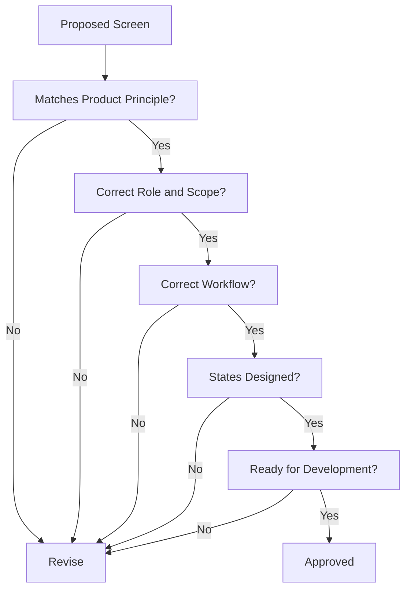

**Figure 12:** UX acceptance decision flow.

### 12.2 Explanation

The checklist below should be used before approving any screen for development. It is intentionally practical. If a screen fails any mandatory item, it should be revised before engineering continues.

### 12.3 Business Rules

| Rule ID | Business Rule |
| --- | --- |
| UX-BR-12.1 | A screen that allows public signup shall fail review. |
| UX-BR-12.2 | A screen that lets a user choose unauthorized role or scope shall fail review. |
| UX-BR-12.3 | A person-related screen without search-before-create shall fail review unless explicitly justified. |
| UX-BR-12.4 | A lifecycle action that overwrites history shall fail review. |
| UX-BR-12.5 | A screen without required states shall not be handed to development as final. |

### 12.4 Design Decisions

| Decision ID | Decision | Why This Exists |
| --- | --- | --- |
| UX-DD-12.1 | Use acceptance criteria for design review. | Visual quality alone is not enough; the design must implement the correct system. |
| UX-DD-12.2 | Block designs that violate governance. | Incorrect UX can cause incorrect software behavior and data model damage. |
| UX-DD-12.3 | Make state design mandatory. | Real users encounter missing data, errors, denied access, and pending states. |

### 12.5 Checklist

| Area | Acceptance Question | Pass / Fail |
| --- | --- | --- |
| Product fit | Does the screen support the platform as a governed operating system, not a generic app? |  |
| Signup | Does the screen avoid public self-signup? |  |
| Activation | If account creation is involved, is it activation/invitation-based? |  |
| Role control | Does the screen prevent users from choosing their own role or scope? |  |
| Scope | Is the current organization or Pathshala scope visible where needed? |  |
| Person model | Does the flow search for a person before creating one? |  |
| Admission | Does the flow keep person registration separate from student admission? |  |
| Teacher model | Does the flow keep teacher profile separate from teacher assignment? |  |
| Registry vs operations | Is the screen clearly registry management or operational activity? |  |
| History | Are lifecycle actions handled without silent overwrites? |  |
| Permissions | Are hidden, disabled, unauthorized, and denied states considered? |  |
| Empty state | Is there a clear empty state? |  |
| Loading state | Is there a clear loading state? |  |
| Error state | Is there a clear error and recovery state? |  |
| Validation | Are required fields and validation errors designed? |  |
| Confirmation | Are sensitive actions confirmed? |  |
| Mobile | Is mobile behavior defined for Learning App screens? |  |
| Developer handoff | Are components, spacing, behavior, and notes ready for implementation? |  |

### 12.6 Notes

This checklist should be attached to design review. A screen should not be approved only because it looks polished. It must also match the platform's governance, identity, authorization, and lifecycle principles.

### 12.7 Open Questions

| Question ID | Open Question |
| --- | --- |
| UX-OQ-12.1 | Should this checklist be converted into a formal design review template? |
| UX-OQ-12.2 | Should QA use the same checklist when testing implemented screens? |

---

## Appendix A: Immediate Redesign Instructions for Current Authentication Page

| Current Issue | Required Correction | Reason |
| --- | --- | --- |
| Public signup exists or is implied. | Remove public signup from primary authentication flow. | Users cannot join the governed ecosystem by themselves. |
| User can choose account type. | Remove role selection from authentication. | Roles and scopes are assigned by authorized workflows. |
| Signup creates a normal user. | Replace with account activation after person registration and access approval. | Person identity must exist before account access. |
| Page explains the app as open to anyone. | Rewrite copy to say access is provided by administrators. | Sets correct expectation. |
| No unauthorized state. | Add unauthorized/no-access screen. | Users may authenticate but lack scope or active access. |
| No activation state. | Add activation, expired token, and invalid token screens. | Governed access needs a complete account lifecycle. |

Recommended login page actions:

| Action | Include? |
| --- | --- |
| Sign in | Yes |
| Forgot password | Yes |
| Activate account | Yes, if activation flow is implemented |
| Contact administrator | Optional |
| Create account / Sign up | No |
| Choose role | No |
| Join Pathshala | No |

---

## Appendix B: Screen Inventory Summary

| Area | Screens |
| --- | --- |
| Authentication | Login, Activate Account, Forgot Password, Reset Password, Access Help, Unauthorized, Expired Link |
| Portal Dashboard | Global Dashboard, Pathshala Dashboard, Alerts, Recent Activity |
| Registries | Person List, Person Detail, Create Person, Duplicate Review, Pathshala List, Pathshala Detail, Committee List, User Account List |
| Operations | Admission List, Create Admission, Admission Detail, Transfer, Completion, Withdrawal, Teacher Profile List, Teacher Profile Detail, Teacher Assignment List, Create Assignment |
| Attendance | Session List, Session Detail, Attendance Capture, Attendance Review, Attendance Correction |
| Notices | Notice List, Create Notice, Notice Preview, Notice Detail |
| Reports | Attendance Report, Student Report, Teacher Assignment Report, Pathshala Status Report |
| Governance | Roles, Permission Matrix, Scope Assignment, Override Management, Audit Log |
| Learning App | Today, Schedule, Class Detail, Take Attendance, Notices, Profile, Attendance History |

---

## Appendix C: Copy Guidelines

| Situation | Recommended Copy Direction |
| --- | --- |
| Login helper text | "Access is provided by your Gita Pathshala administrator." |
| No signup explanation | "If you need access, contact your Pathshala administrator." |
| Activation | "Activate your account using the invitation provided by your administrator." |
| Unauthorized | "Your account does not have access to this area." |
| Empty teacher schedule | "No classes are assigned for this day." |
| Empty student schedule | "No classes are scheduled for today." |
| Duplicate person warning | "A similar person record already exists. Review before creating a new person." |
| Transfer confirmation | "This will close the current admission and preserve the student's history." |
| Assignment end confirmation | "This will end the assignment from the selected date. Past records will remain available." |
