# Gita Pathshala Management Platform

# Product Vision & Architecture Principles

**Document ID:** GP-VAP-001  
**Version:** 0.1  
**Status:** Draft  
**Document Type:** Product Vision and Architecture Foundation  
**Prepared For:** Central Governing Organization and Implementation Partners  
**Prepared By:** Product Management and Enterprise Architecture  
**Date:** 2026-06-30  

**Header:** GP-VAP-001 | Product Vision & Architecture Principles | Version 0.1  
**Footer:** Confidential Project Documentation | Gita Pathshala Management Platform

---

## Document Control

| Attribute | Value |
| --- | --- |
| Document ID | GP-VAP-001 |
| Document Title | Product Vision & Architecture Principles |
| Version | 0.1 |
| Status | Draft |
| Owner | Product Management and Enterprise Architecture |
| Primary Audience | Committee Members, Product Managers, Solution Architects, UI/UX Designers, Flutter Developers, Backend Developers, QA Engineers, Future Vendors |
| Related Documents | GP-STD-000 Documentation Standards; GP-PRO-002 Project Proposal; GP-DOM-003 Domain Model; GP-SRS-004 Software Requirements Specification; GP-DBD-005 Database Design; GP-API-006 API Specification; GP-UXD-007 UI/UX Design Brief; GP-RDM-008 Development Roadmap |
| Approval Authority | Central Governing Organization |

---

## Revision History

| Version | Date | Author | Description |
| --- | --- | --- | --- |
| 0.1 | 2026-06-30 | Product Management and Enterprise Architecture | Initial draft defining product vision, enterprise architecture principles, governance model, application boundaries, and foundational ADRs. |

---

## Table of Contents

1. Executive Vision  
2. Product Scope and Operating Model  
3. Federated Governance Architecture  
4. Person-Centric Identity Model  
5. Registries and Operational Records  
6. Application Architecture  
7. Authorization, Scope, and Governance Control  
8. Historical Integrity and Lifecycle Design  
9. Platform Architecture Principles  
10. Architecture Decision Records  
11. Foundation for Future Documents  

---

## 1. Executive Vision

### 1.1 High-Level Diagram

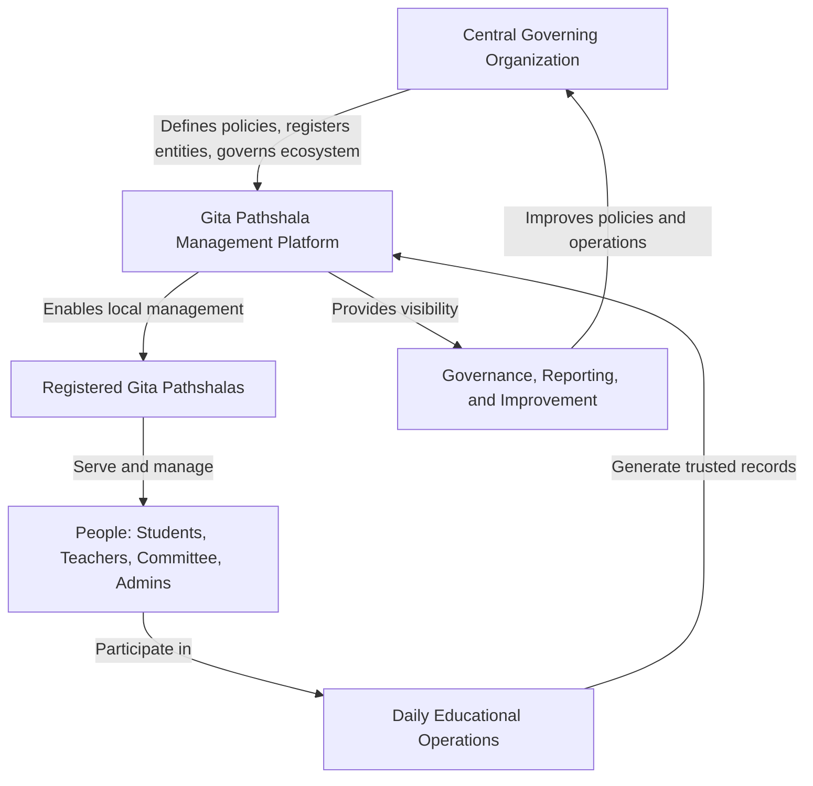

**Figure 1:** Product vision operating loop.

### 1.2 Explanation

The Gita Pathshala Management Platform is a digital operating platform for a federated educational and cultural organization. It is not an attendance application, a student list, or a collection of administrative screens. The platform exists to represent how Gita Pathshalas are governed, organized, operated, and improved across many local centers under a central governing body.

The product vision is to create a trusted, scalable, person-centric operating system for Gita Pathshala management. A central organization must be able to register people, create Pathshalas, assign local administrators, maintain authoritative registries, set governance policies, and review operational health. Each local Pathshala must be able to manage daily education: student admissions, teacher assignments, class schedules, attendance, notices, and routine coordination.

This document establishes the principles that all future product, domain, database, API, UI, and roadmap documents must follow. Future documents may add detail, but they must not contradict the product philosophy and architecture decisions defined here without recording a formal Architecture Decision Record.

The strategic purpose of the platform is to make organizational truth visible and durable. It should help the organization answer questions such as:

| Question | Platform Capability Required |
| --- | --- |
| Who is this person across the entire organization? | Single person registry and identity lifecycle |
| Which Pathshala is responsible for this student's current education? | Admission and transfer history |
| Where does this teacher serve, and on what schedule? | Teacher profiles and teacher assignments |
| Which Pathshalas are active and operationally healthy? | Pathshala registry, reporting, and monitoring |
| Who has authority to perform each action? | Role, permission, and scope-based authorization |
| What happened historically, and when? | Append-friendly operational records and lifecycle events |

The platform should be understandable to non-technical leaders while being precise enough for software vendors to implement. The product must therefore treat governance, identity, lifecycle, and authorization as core architecture concerns rather than later implementation details.

### 1.3 Business Rules

| Rule ID | Business Rule |
| --- | --- |
| BR-1.1 | The platform shall support many registered Pathshalas under one central governing organization. |
| BR-1.2 | The central organization shall remain the authority for ecosystem-level registries, governance policies, and administrative delegation. |
| BR-1.3 | Each Pathshala shall independently manage approved local educational operations within its assigned scope. |
| BR-1.4 | The platform shall model people once and allow each person to participate in multiple journeys over time. |
| BR-1.5 | The platform shall preserve historical records needed for audit, reporting, transfer, completion, and organizational continuity. |
| BR-1.6 | Product decisions shall prioritize organizational correctness over screen-level convenience. |

### 1.4 Design Decisions

| Decision ID | Decision | Rationale |
| --- | --- | --- |
| DD-1.1 | Define the platform as a digital operating platform, not a single-purpose attendance system. | Attendance is only one operational activity. The organization also needs governance, registration, admission, assignment, notices, reporting, and lifecycle history. |
| DD-1.2 | Establish this document as the foundation for the documentation suite. | Later documents need a stable product and architecture baseline to avoid contradictory implementation assumptions. |
| DD-1.3 | Use diagram-first enterprise documentation. | Diagrams help business stakeholders, designers, developers, and vendors align on the same operating model before implementation detail is introduced. |

### 1.5 Notes

This document intentionally defines architecture principles and product boundaries. It does not replace the future domain model, software requirements specification, database design, API specification, UI/UX design brief, or development roadmap. Those documents must reference this document and refine the relevant sections.

### 1.6 Open Questions

| Question ID | Open Question |
| --- | --- |
| OQ-1.1 | What is the official legal or organizational name of the central governing organization to be used in production materials? |
| OQ-1.2 | Should the platform support multiple governing organizations in a future multi-tenant model, or is one governing organization sufficient for the planned product lifecycle? |

---

## 2. Product Scope and Operating Model

### 2.1 High-Level Diagram

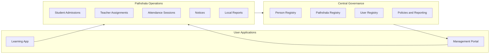

**Figure 2:** Product scope across governance, local operations, and applications.

### 2.2 Explanation

The product scope is defined around the real operating structure of a Gita Pathshala organization. The central organization governs the ecosystem; local Pathshalas operate education within delegated boundaries. The platform must support both modes without confusing them.

Central governance capabilities include person registration, Pathshala registration, user account governance, role and permission assignment, policy definition, and reporting. These capabilities establish organizational truth and ensure that local operations happen within a trusted structure.

Local operational capabilities include admitting students to a Pathshala, assigning teachers to classes and schedules, recording attendance, publishing notices, viewing daily schedules, and producing operational reports. These capabilities help local teams run the Pathshala efficiently without requiring the central organization to perform every daily action.

The scope is intentionally divided between two applications:

| Application | Primary Purpose | Primary Users |
| --- | --- | --- |
| Management Portal | Administration, governance, reporting, monitoring | Super Admin, Operations Member, Pathshala Admin, Committee Member |
| Learning App | Daily work, schedule, attendance, notices, profile | Teacher, Student |

This separation is not only a user interface decision. It protects the product from becoming overloaded with mismatched workflows. Administrative users need broad visibility, structured forms, tables, filters, approvals, and reports. Teachers and students need fast access to today's responsibilities, schedules, attendance, notices, and personal information.

### 2.3 Business Rules

| Rule ID | Business Rule |
| --- | --- |
| BR-2.1 | The platform shall provide exactly two user applications in the initial product architecture: Management Portal and Learning App. |
| BR-2.2 | The Management Portal shall support administrative, governance, reporting, and monitoring workflows. |
| BR-2.3 | The Learning App shall support teacher and student daily workflows. |
| BR-2.4 | Central governance functions shall not be implemented as local-only workflows. |
| BR-2.5 | Local Pathshala operations shall respect central registry data, policies, roles, permissions, and scopes. |
| BR-2.6 | A capability shall be considered in scope only if it supports governance, education operations, identity, reporting, or lifecycle history. |

### 2.4 Design Decisions

| Decision ID | Decision | Rationale |
| --- | --- | --- |
| DD-2.1 | Split users by work context rather than by every role. | A role-based app for each user type would create unnecessary fragmentation. Two applications cover the major work modes cleanly. |
| DD-2.2 | Keep local operations within centrally governed boundaries. | This allows Pathshalas to operate independently without losing organizational control or reporting consistency. |
| DD-2.3 | Treat reporting and monitoring as first-class product scope. | The central organization cannot govern hundreds or thousands of Pathshalas without reliable visibility into operations. |

### 2.5 Notes

Future versions may add public websites, parent portals, advanced learning content, payment management, or analytics workspaces. Those capabilities are outside the foundational scope unless formally added through roadmap and architecture review.

### 2.6 Open Questions

| Question ID | Open Question |
| --- | --- |
| OQ-2.1 | Should parents or guardians have a dedicated access model in the initial release, or should student-facing access be sufficient at first? |
| OQ-2.2 | Which reports are mandatory for launch, and which can be deferred to later roadmap phases? |

---

## 3. Federated Governance Architecture

### 3.1 High-Level Diagram

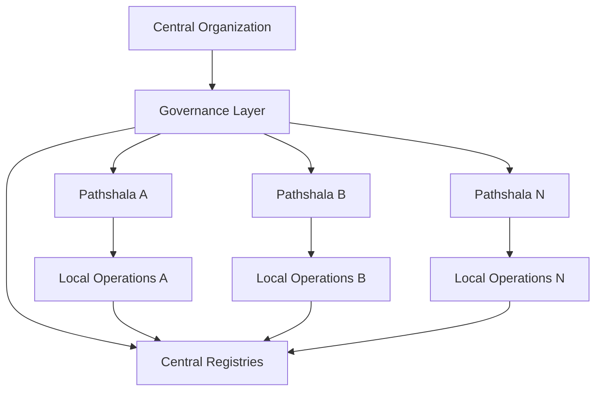

**Figure 3:** Federated governance model.

### 3.2 Explanation

The platform follows the principle: **Govern Centrally. Operate Locally.**

This means the central organization is responsible for the integrity of the ecosystem, while local Pathshalas are responsible for day-to-day educational work. Central governance is not the same as centralized micromanagement. The platform must give central leadership authority over the registry, policy, roles, permissions, Pathshala creation, and reporting, while giving local teams the autonomy required to run classes.

A federated architecture is necessary because a Gita Pathshala network may grow to hundreds or thousands of local centers. A purely centralized operational model would not scale because every local action would require central intervention. A purely decentralized model would create fragmented data, inconsistent identities, and weak governance. Federated governance balances both needs.

In this model:

| Responsibility | Central Organization | Local Pathshala |
| --- | --- | --- |
| Person registration | Owns and governs | Uses registered people for admissions and assignments |
| Pathshala creation | Owns and governs | Operates after registration |
| Admin delegation | Assigns or approves | Performs local administration |
| Student admission | Defines policy and visibility | Executes admission within local scope |
| Teacher assignment | Defines rules and visibility | Assigns teachers to classes and schedules |
| Attendance | Defines reporting expectations | Records daily attendance |
| Notices | Defines governance rules where needed | Publishes local notices |
| Reporting | Reviews across organization | Reviews local status |

The architecture must make scope explicit. A Pathshala Admin should not automatically gain authority over the entire organization. An Operations Member may have broader access, but even that access should be permissioned and auditable. Committee Members may need visibility and review capability without operational mutation rights.

### 3.3 Business Rules

| Rule ID | Business Rule |
| --- | --- |
| BR-3.1 | The central organization shall be the authority for creating and maintaining the Pathshala registry. |
| BR-3.2 | The central organization shall be the authority for person registration unless delegated under explicit policy. |
| BR-3.3 | Each Pathshala shall operate only within its assigned scope. |
| BR-3.4 | A user may have different permissions in different scopes. |
| BR-3.5 | Governance reporting shall support cross-Pathshala visibility for authorized central users. |
| BR-3.6 | Local operational data shall remain associated with the responsible Pathshala for audit and reporting. |

### 3.4 Design Decisions

| Decision ID | Decision | Rationale |
| --- | --- | --- |
| DD-3.1 | Use federated governance as the primary organizational architecture. | The organization requires central consistency and local autonomy. Neither fully centralized nor fully decentralized operation is appropriate. |
| DD-3.2 | Make Pathshala scope a core authorization dimension. | Scope prevents users from applying permissions outside their legitimate operational boundary. |
| DD-3.3 | Design reports around governance needs, not only local dashboards. | Leadership must detect inactive centers, attendance trends, assignment gaps, and data quality issues across the network. |

### 3.5 Notes

Federated governance should be visible in the information architecture, database model, API authorization layer, audit model, and UI. It should not be implemented only as a frontend filter because frontend-only controls cannot enforce governance.

### 3.6 Open Questions

| Question ID | Open Question |
| --- | --- |
| OQ-3.1 | Can a Pathshala Admin manage more than one Pathshala, and if yes, should this be common or exceptional? |
| OQ-3.2 | Which operations require central approval before becoming effective locally? |

---

## 4. Person-Centric Identity Model

### 4.1 High-Level Diagram

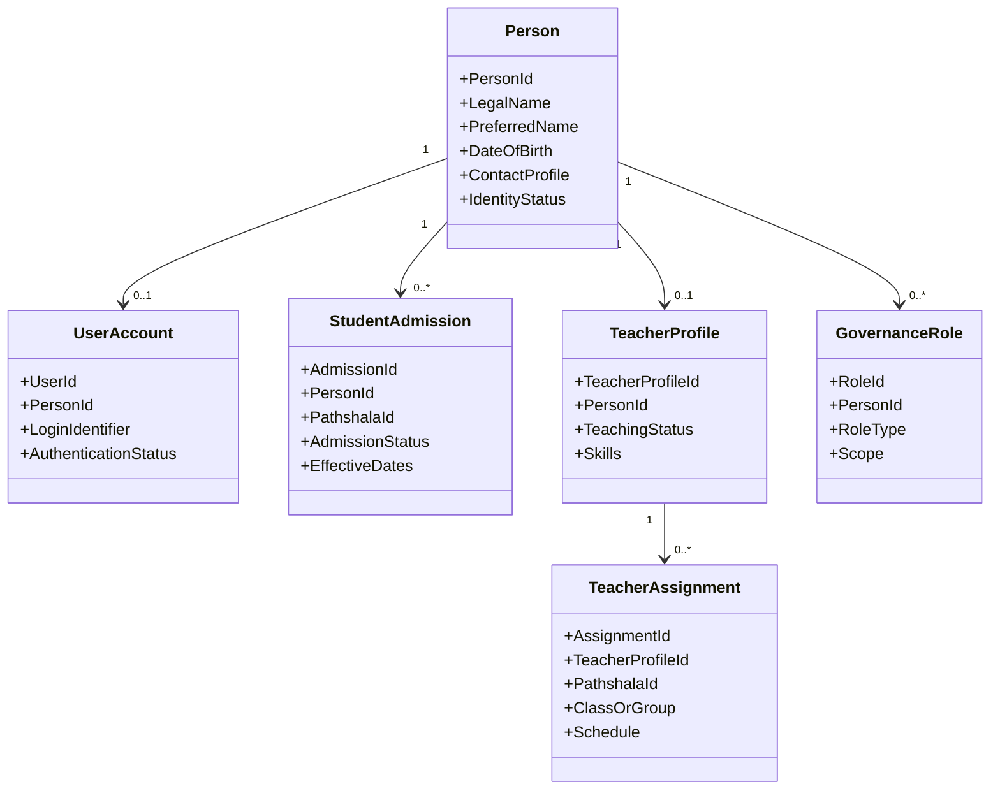

**Figure 4:** One person, one identity, many journeys.

### 4.2 Explanation

The platform follows the principle: **One Person. One Identity. Many Journeys.**

Every human being must be registered exactly once in the platform. Student, teacher, committee member, Pathshala admin, and operations member are not separate human identities. They are roles, assignments, or journeys attached to the same person over time.

This principle exists because real people participate in the organization in multiple ways. A student may later become a teacher. A teacher may also be a committee member. A Pathshala Admin may have a child admitted as a student. If the system creates separate records for each role, the organization loses the ability to understand a person's full relationship with the Gita Pathshala network.

The person-centric model also prevents duplicate records, fragmented history, and access confusion. It allows the platform to preserve a person's complete journey while keeping operational concepts separate. For example, becoming a student does not mean creating a new person. It means admitting an existing person to a Pathshala. Becoming a teacher does not mean creating another person. It means adding a teacher profile and one or more teacher assignments.

The distinction between person and user account is also important. A person may exist in the registry without login access. A young student may be registered but not have a user account. A committee member may have a user account because they need system access. The platform must not assume that every person is a system user.

### 4.3 Business Rules

| Rule ID | Business Rule |
| --- | --- |
| BR-4.1 | Each human shall have one person record in the person registry. |
| BR-4.2 | A person may have zero or one active user account. |
| BR-4.3 | A person may have multiple journeys over time, including student, teacher, committee, admin, or operations participation. |
| BR-4.4 | Student admission shall reference an existing person rather than create an independent student identity. |
| BR-4.5 | Teacher profile shall reference an existing person rather than create an independent teacher identity. |
| BR-4.6 | User roles shall be assigned to people or user accounts according to access control design, but identity shall remain person-centric. |
| BR-4.7 | Duplicate person creation shall be actively prevented through search, matching, and administrative review. |

### 4.4 Design Decisions

| Decision ID | Decision | Rationale |
| --- | --- | --- |
| DD-4.1 | Use Person as the root human identity. | This reflects real organizational participation and prevents duplicate identities for the same human. |
| DD-4.2 | Separate Person from User Account. | Not every registered person requires login access, and access can be suspended without deleting the person. |
| DD-4.3 | Model student and teacher participation as journeys linked to Person. | This preserves history and allows people to move between roles over time. |

### 4.5 Notes

The future domain model must define person matching, uniqueness rules, required fields, optional fields, and duplicate resolution workflows. The future API specification must ensure that person search and selection are part of admission and assignment flows.

### 4.6 Open Questions

| Question ID | Open Question |
| --- | --- |
| OQ-4.1 | What minimum information is required to create a person record when date of birth or contact details are unavailable? |
| OQ-4.2 | Should duplicate detection be advisory at launch, or should it block creation until reviewed? |

---

## 5. Registries and Operational Records

### 5.1 High-Level Diagram

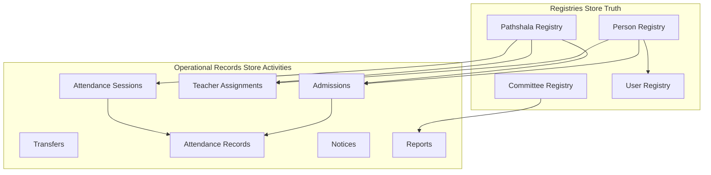

**Figure 5:** Registry and operational record separation.

### 5.2 Explanation

The platform follows the principle: **Registries store truth. Operational records store activities.**

Registries contain authoritative reference information about the organization. They describe entities that must remain stable, governed, and reusable. The Person Registry identifies humans. The Pathshala Registry identifies registered Pathshalas. The Committee Registry identifies governance groups and committee relationships. The User Registry identifies system access accounts.

Operational records describe actions, events, and activities. Admissions connect registered people to Pathshalas as students. Teacher assignments connect teacher profiles to Pathshalas, classes, days, and time slots. Attendance sessions and attendance records capture educational participation. Notices communicate operational information. Reports summarize operational status.

This separation exists because registry truth and operational activity have different lifecycles. A person may remain in the registry after an admission ends. A Pathshala may remain registered even if operations pause. A teacher profile may remain valid while assignments change. If operational activity is stored directly as mutable attributes on registry records, the platform will lose history and make reporting unreliable.

The design must make it easy to answer both current-state and historical questions. For example:

| Question Type | Example | Data Source |
| --- | --- | --- |
| Registry truth | Who is this person? | Person Registry |
| Current operation | Where is this student currently admitted? | Active Student Admission |
| Historical operation | Which Pathshalas did this student attend previously? | Admission and Transfer History |
| Assignment truth | Who is approved as a teacher? | Teacher Profile |
| Schedule operation | Where does the teacher teach on Saturday? | Teacher Assignment |

### 5.3 Business Rules

| Rule ID | Business Rule |
| --- | --- |
| BR-5.1 | Registry records shall be treated as authoritative source records. |
| BR-5.2 | Operational records shall reference registry records rather than duplicate registry truth. |
| BR-5.3 | Admission shall be an operational record, not a person subtype. |
| BR-5.4 | Teacher assignment shall be an operational record, not a teacher profile attribute. |
| BR-5.5 | Attendance shall be recorded against an attendance session and a relevant student admission context. |
| BR-5.6 | Operational records shall support effective dates, status, and audit metadata where needed. |

### 5.4 Design Decisions

| Decision ID | Decision | Rationale |
| --- | --- | --- |
| DD-5.1 | Separate registries from operational records. | This prevents unstable activity data from corrupting authoritative identity and organizational records. |
| DD-5.2 | Require operational records to reference registries. | This allows reporting to connect daily activity to trusted organizational structures. |
| DD-5.3 | Design operational records for lifecycle and history. | Admissions, assignments, and attendance are time-based activities that must support current and historical views. |

### 5.5 Notes

Future database design must preserve this separation physically and logically. API naming should also reflect this distinction. For example, `/persons` and `/pathshalas` represent registries, while `/admissions`, `/teacher-assignments`, and `/attendance-sessions` represent operational workflows.

### 5.6 Open Questions

| Question ID | Open Question |
| --- | --- |
| OQ-5.1 | Which registry changes require approval, and which can be updated directly by authorized users? |
| OQ-5.2 | How long should inactive operational records remain visible in default UI views? |

---

## 6. Application Architecture

### 6.1 High-Level Diagram

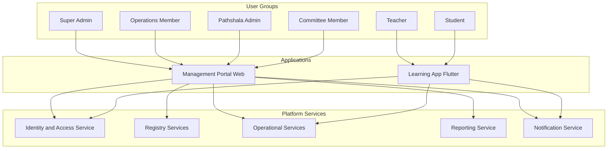

**Figure 6:** Two-application architecture.

### 6.2 Explanation

The platform has two applications: the Management Portal and the Learning App.

The Management Portal is a web application for governance, administration, reporting, and monitoring. It serves users who need structured, information-dense workflows: Super Admins, Operations Members, Pathshala Admins, and Committee Members. These users need tables, filters, forms, approval workflows, registry management, audit visibility, and reports. The portal must support both central and local administration according to permission and scope.

The Learning App is a Flutter application for Android and iOS, with future web support possible. It serves teachers and students. The Learning App should focus on daily work rather than administrative complexity. Teachers need today's classes, attendance capture, notices, schedules, and profile access. Students need their schedule, attendance visibility where appropriate, notices, and profile information.

The application architecture should not duplicate business logic across clients. Clients should use platform services through APIs. Authorization must be enforced server-side. The user interface may hide unavailable actions, but the backend must remain the enforcement point.

The service architecture can evolve over time. The initial implementation may be a modular monolith if that reduces delivery risk. The important architectural requirement is clear domain boundaries, not premature microservices. The system should define modules such as identity and access, registries, admissions, teacher assignments, attendance, notices, reporting, and audit. These modules may later become independent services if scale or organizational needs justify it.

### 6.3 Business Rules

| Rule ID | Business Rule |
| --- | --- |
| BR-6.1 | Administrative and governance workflows shall be implemented in the Management Portal. |
| BR-6.2 | Teacher and student daily workflows shall be implemented in the Learning App. |
| BR-6.3 | Server-side APIs shall enforce authorization regardless of client behavior. |
| BR-6.4 | Shared domain rules shall live in backend services, not only in frontend clients. |
| BR-6.5 | The Learning App shall not expose central governance capabilities. |
| BR-6.6 | The Management Portal may support local Pathshala administration when the user has the correct role, permission, and scope. |

### 6.4 Design Decisions

| Decision ID | Decision | Rationale |
| --- | --- | --- |
| DD-6.1 | Use a web Management Portal for administration. | Administrative users benefit from desktop-oriented workflows, data tables, reporting, and multi-step forms. |
| DD-6.2 | Use Flutter for the Learning App. | Teachers and students need mobile-first access across Android and iOS, with future web potential. |
| DD-6.3 | Prefer modular backend boundaries before distributed services. | Clear modules provide architectural discipline without introducing avoidable operational complexity early. |
| DD-6.4 | Keep authorization enforcement in backend services. | Client-side checks improve usability but cannot be trusted as governance controls. |

### 6.5 Notes

The future UI/UX design brief must define detailed navigation, screen hierarchy, interaction states, accessibility expectations, and responsive behavior. The future API specification must define endpoint contracts and error behavior for both applications.

### 6.6 Open Questions

| Question ID | Open Question |
| --- | --- |
| OQ-6.1 | Should the Management Portal be optimized first for desktop only, or should tablet support be included in the first release? |
| OQ-6.2 | What offline capability, if any, is required for the Learning App attendance workflow? |

---

## 7. Authorization, Scope, and Governance Control

### 7.1 High-Level Diagram

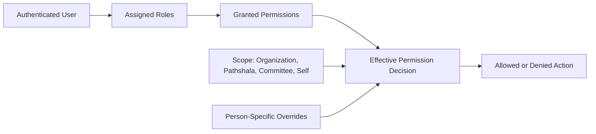

**Figure 7:** Effective permission model.

### 7.2 Explanation

The platform uses a hybrid authorization model:

**Role + Permission + Scope = Effective Permission**

Roles describe the user's organizational identity. Permissions describe allowed actions. Scope describes where those actions apply. Person-specific overrides handle exceptional cases that cannot be cleanly represented by standard roles.

This model exists because role-only access control is too coarse for federated governance. A Pathshala Admin may be allowed to admit students, but only for assigned Pathshalas. An Operations Member may review reports across multiple Pathshalas. A Committee Member may see reports but not edit attendance. A teacher may record attendance only for assigned sessions. A student may view only their own information.

The platform must avoid two common authorization failures. First, it must not grant broad access merely because someone has an administrative title. Second, it must not create so many hard-coded roles that the system becomes impossible to manage. Separating roles, permissions, and scopes allows the organization to grow without rewriting access logic for every new scenario.

Effective permission decisions should be auditable and explainable. When a user performs a sensitive action, the system should be able to determine which role, permission, scope, and override allowed the action. When access is denied, the system should fail securely and provide user-appropriate feedback without exposing sensitive data.

### 7.3 Business Rules

| Rule ID | Business Rule |
| --- | --- |
| BR-7.1 | Every protected action shall require an effective permission decision. |
| BR-7.2 | Roles shall not be treated as sufficient authorization without permissions and scope. |
| BR-7.3 | Scope shall limit where a permission can be exercised. |
| BR-7.4 | Person-specific permission overrides shall be supported for approved exceptions. |
| BR-7.5 | Permission overrides shall be auditable and reviewable. |
| BR-7.6 | Sensitive actions shall generate audit events. |
| BR-7.7 | Authorization shall be enforced on the backend for all protected APIs. |

### 7.4 Design Decisions

| Decision ID | Decision | Rationale |
| --- | --- | --- |
| DD-7.1 | Use hybrid authorization instead of role-only authorization. | The organization needs nuanced access control across central and local scopes. |
| DD-7.2 | Include scope as a first-class authorization element. | Federated governance depends on clear boundaries between organization-wide and Pathshala-specific authority. |
| DD-7.3 | Allow person-specific overrides with audit controls. | Real organizations have exceptions, but exceptions must remain visible and governed. |
| DD-7.4 | Make authorization decisions explainable. | Support, audit, and governance teams need to understand why access was allowed or denied. |

### 7.5 Notes

The future API specification must define standard authorization error responses. The future database design must model roles, permissions, scopes, assignments, overrides, and audit events in a way that supports efficient authorization decisions.

### 7.6 Open Questions

| Question ID | Open Question |
| --- | --- |
| OQ-7.1 | Who is allowed to grant person-specific permission overrides? |
| OQ-7.2 | How often must central governance review active high-risk permissions and overrides? |

---

## 8. Historical Integrity and Lifecycle Design

### 8.1 High-Level Diagram

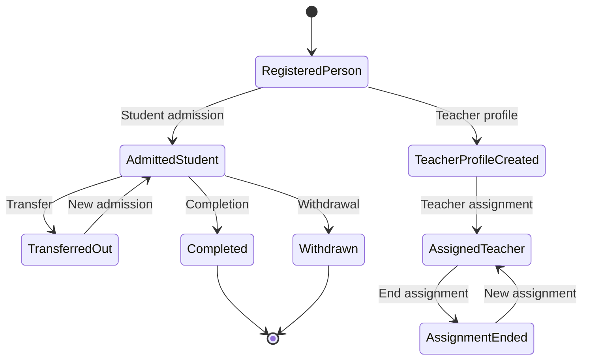

**Figure 8:** Person journey and historical lifecycle.

### 8.2 Explanation

The platform follows the principle: **History should never be destroyed.**

Historical integrity is required because education and governance depend on knowing what happened over time. A student's admission should not be overwritten when the student transfers. A teacher assignment should not be replaced when the teacher changes schedules. Attendance should not disappear when a class changes. Instead, the platform should record lifecycle events and maintain the ability to reconstruct previous states.

This principle does not mean every typo must become permanent. The platform may allow correction workflows for data entry mistakes. However, corrections should be traceable when they affect important records. The central rule is that business history should not be silently destroyed.

The student journey demonstrates the expected approach:

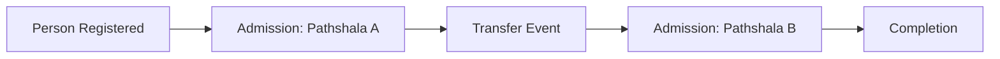

**Figure 9:** Admission, transfer, new admission, completion.

Teacher history follows the same logic. A teacher profile describes the person as an approved teacher. Teacher assignments describe where, when, and what they teach. Ending one assignment should not erase the teacher profile or previous assignment history.

Historical integrity supports:

| Need | Why History Matters |
| --- | --- |
| Governance audit | Leaders need to know who changed what and when. |
| Student continuity | Transfers require previous education context. |
| Teacher accountability | Assignments and attendance responsibilities must be traceable. |
| Reporting accuracy | Historical reports must not change unexpectedly when current data changes. |
| Organizational memory | Long-running institutions need durable records beyond individual administrators. |

### 8.3 Business Rules

| Rule ID | Business Rule |
| --- | --- |
| BR-8.1 | Student admission changes shall preserve prior admission history. |
| BR-8.2 | Transfers shall be represented as lifecycle events or linked operational records, not as direct overwrites. |
| BR-8.3 | Teacher assignment changes shall preserve previous assignment history. |
| BR-8.4 | Attendance records shall not be deleted as a normal correction mechanism. |
| BR-8.5 | Sensitive corrections shall record who made the correction, when, and why. |
| BR-8.6 | Reports shall distinguish current state from historical state. |

### 8.4 Design Decisions

| Decision ID | Decision | Rationale |
| --- | --- | --- |
| DD-8.1 | Use lifecycle records instead of overwriting business history. | This allows the platform to reconstruct journeys and provide reliable audit and reporting. |
| DD-8.2 | Separate correction from lifecycle progression. | A typo correction is different from a transfer, completion, or assignment change. |
| DD-8.3 | Preserve ended assignments and admissions as historical records. | Inactive records remain valuable for continuity, reporting, and accountability. |

### 8.5 Notes

The future database design should define status fields, effective dates, audit fields, immutable event records where appropriate, and data retention policies. The future SRS should define correction workflows and approval requirements.

### 8.6 Open Questions

| Question ID | Open Question |
| --- | --- |
| OQ-8.1 | Which historical records are legally or organizationally required to be retained permanently? |
| OQ-8.2 | Which corrections should require approval before becoming visible in reports? |

---

## 9. Platform Architecture Principles

### 9.1 High-Level Diagram

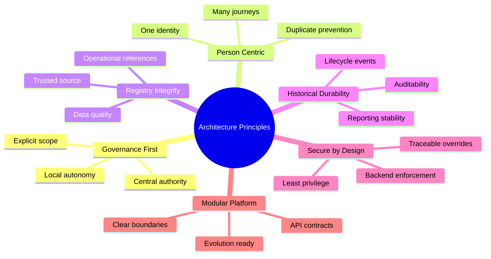

**Figure 10:** Architecture principles map.

### 9.2 Explanation

The architecture principles define the rules that guide product design, software design, data design, API design, and implementation sequencing. They exist to protect the platform from short-term decisions that would make future growth difficult.

#### Principle 1: Govern Centrally. Operate Locally.

This principle exists because the organization needs central consistency and local execution. Central governance protects identity, policy, and reporting. Local operation allows each Pathshala to run daily classes without waiting for central staff.

Architectural implications:

| Area | Implication |
| --- | --- |
| Data model | Pathshala scope must be represented in operational records. |
| Authorization | Permissions must include scope. |
| UI | Central and local users may see different navigation and records. |
| Reporting | Central reports must aggregate local operations. |

#### Principle 2: One Person. One Identity. Many Journeys.

This principle exists because people participate in the organization in multiple ways over time. It prevents duplicate records, fragmented histories, and inconsistent access.

Architectural implications:

| Area | Implication |
| --- | --- |
| Data model | Person becomes the root human identity. |
| Workflows | Admission and assignment must search or create a person first. |
| Reporting | Reports can show full participation across journeys. |
| Access | User account remains separate from person identity. |

#### Principle 3: Registration is Not Admission.

This principle exists because registering a person identifies the human; admitting a student places that person into a Pathshala's educational operation. Treating registration and admission as the same action would make transfers, multiple journeys, and history difficult.

Architectural implications:

| Area | Implication |
| --- | --- |
| Domain model | Person and Student Admission are separate entities. |
| UI | Admission flow must select an existing person or create one before admission. |
| Reporting | Student counts are based on active admissions, not person count. |
| History | Transfers can preserve prior admission records. |

#### Principle 4: Teacher Profile is Not Teacher Assignment.

This principle exists because a teacher's identity and qualifications are different from where, when, and what they teach. A teacher may serve multiple Pathshalas, classes, days, and time slots.

Architectural implications:

| Area | Implication |
| --- | --- |
| Domain model | Teacher Profile and Teacher Assignment are separate entities. |
| Scheduling | Multiple active assignments may exist for one teacher. |
| Authorization | A teacher's app access may depend on active assignments. |
| Reporting | Assignment coverage can be measured independently from teacher count. |

#### Principle 5: Registries Store Truth. Operational Records Store Activities.

This principle exists because authoritative organizational data and daily activity data change for different reasons. Mixing them creates fragile systems and unreliable reporting.

Architectural implications:

| Area | Implication |
| --- | --- |
| Database | Registry tables and operational tables have distinct lifecycle rules. |
| APIs | Registry endpoints and operational workflow endpoints are separated. |
| Audit | Registry changes may require stronger governance controls. |
| Reporting | Activity is interpreted through trusted registry references. |

#### Principle 6: History Should Never Be Destroyed.

This principle exists because educational and governance records remain valuable after current state changes. The platform must preserve institutional memory.

Architectural implications:

| Area | Implication |
| --- | --- |
| Data model | Effective dates, status, lifecycle records, and audit fields are required. |
| UI | Users need current views and history views. |
| Reports | Historical reports must remain reproducible. |
| Operations | Corrections require traceability. |

#### Principle 7: Authorization Must Be Explicit and Explainable.

This principle exists because federated governance cannot rely on informal trust or role names alone. The system must know who can do what, where, and why.

Architectural implications:

| Area | Implication |
| --- | --- |
| Security | Backend authorization checks are mandatory. |
| Data model | Role, permission, scope, and override models are required. |
| Audit | Sensitive access and changes must be traceable. |
| Support | Administrators need tools to diagnose access issues. |

#### Principle 8: Build a Modular Platform Before Scaling Complexity.

This principle exists because the organization needs an implementable product, not unnecessary technical complexity. The backend should have clear domain modules and contracts. It does not need premature distributed services unless scale, team structure, or operational needs justify them.

Architectural implications:

| Area | Implication |
| --- | --- |
| Backend | Modules should reflect domain boundaries. |
| APIs | Contracts should be stable and versionable. |
| Delivery | Initial implementation can prioritize cohesive deployment. |
| Evolution | Modules can later become services if justified. |

### 9.3 Business Rules

| Rule ID | Business Rule |
| --- | --- |
| BR-9.1 | Future product and technical documents shall align with the architecture principles in this document. |
| BR-9.2 | Any exception to a principle shall require an Architecture Decision Record. |
| BR-9.3 | Product workflows shall distinguish registration, admission, profile, assignment, and attendance concepts. |
| BR-9.4 | Database, API, and UI design shall support central governance and local operation. |
| BR-9.5 | Security and authorization shall be treated as core architecture concerns, not implementation afterthoughts. |

### 9.4 Design Decisions

| Decision ID | Decision | Rationale |
| --- | --- | --- |
| DD-9.1 | Define architecture principles before detailed requirements. | Requirements without principles often encode accidental workflows and create long-term design problems. |
| DD-9.2 | Require ADRs for principle exceptions. | Exceptions may be valid, but they must be explicit, reviewable, and traceable. |
| DD-9.3 | Optimize for organizational correctness and future growth. | The platform is expected to support many Pathshalas and long-lived records. |

### 9.5 Notes

These principles should appear in vendor onboarding, backlog refinement, architecture review, test strategy, and acceptance criteria. They are not only documentation statements.

### 9.6 Open Questions

| Question ID | Open Question |
| --- | --- |
| OQ-9.1 | Which principle conflicts are acceptable for a minimum viable release, and what governance body approves those exceptions? |
| OQ-9.2 | Should architecture compliance be checked manually during review or formalized in a release checklist? |

---

## 10. Architecture Decision Records

### 10.1 High-Level Diagram

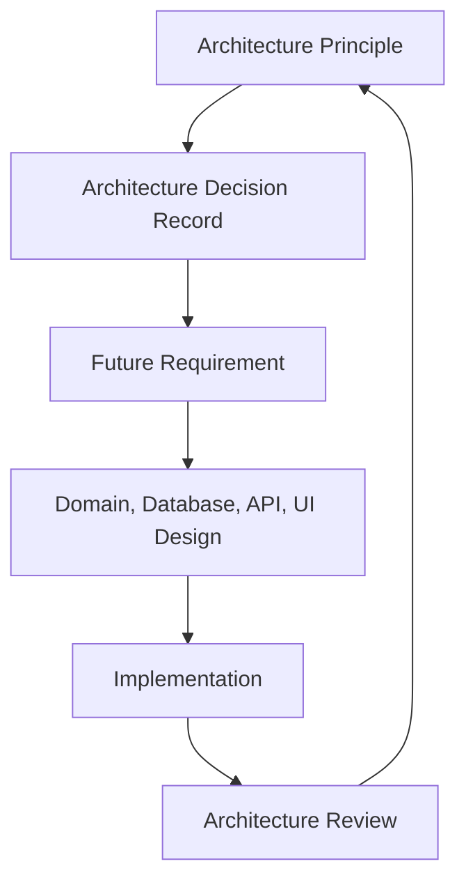

**Figure 11:** ADR relationship to future delivery.

### 10.2 Explanation

Architecture Decision Records capture important product and technical decisions in a durable form. They explain context, decision, rationale, consequences, and status. ADRs are required because the platform will be implemented over time, potentially by multiple teams or vendors. Without written decisions, the organization will repeatedly revisit settled questions or accidentally contradict foundational assumptions.

The ADRs below are binding for future documents unless superseded by a later approved ADR.

### 10.3 Business Rules

| Rule ID | Business Rule |
| --- | --- |
| BR-10.1 | Every major architecture decision shall have a recorded rationale. |
| BR-10.2 | ADRs shall be referenced by future documents when they define related requirements or designs. |
| BR-10.3 | Superseded decisions shall remain visible for historical traceability. |
| BR-10.4 | ADRs shall identify consequences, including tradeoffs and constraints. |

### 10.4 Design Decisions

The following ADRs are included in this foundational document.

#### ADR-001: Define the Product as a Digital Operating Platform

| Field | Value |
| --- | --- |
| Status | Accepted |
| Context | The organization needs software to support Gita Pathshalas across governance, identity, local operations, and reporting. A narrow attendance application would not support the operating model. |
| Decision | The product shall be defined as the Gita Pathshala Management Platform, a digital operating platform for central governance and local Pathshala operations. |
| Why This Exists | The platform must reflect how the organization operates, not merely automate isolated tasks. This protects the product from becoming a set of disconnected CRUD screens. |
| Consequences | Product scope includes governance, registries, admissions, assignments, attendance, notices, reporting, and lifecycle history. Attendance remains important but is not the organizing concept. |

#### ADR-002: Adopt Federated Governance

| Field | Value |
| --- | --- |
| Status | Accepted |
| Context | The organization needs central authority and local operational autonomy. |
| Decision | The platform shall use a federated governance architecture: govern centrally, operate locally. |
| Why This Exists | Centralized operation does not scale across many Pathshalas, while decentralized data weakens governance and reporting. |
| Consequences | Pathshala scope, central registries, delegated administration, and cross-Pathshala reporting must be built into the platform architecture. |

#### ADR-003: Use Person as the Root Human Identity

| Field | Value |
| --- | --- |
| Status | Accepted |
| Context | A human may be a student, teacher, committee member, admin, or operations member over time. |
| Decision | The platform shall register every human once as a Person and attach journeys, roles, profiles, accounts, and assignments to that person. |
| Why This Exists | This prevents duplicate human identities and preserves each person's full organizational journey. |
| Consequences | Admission, teacher profile, user account, and governance role models must reference Person rather than duplicate human identity. |

#### ADR-004: Separate Registration from Admission

| Field | Value |
| --- | --- |
| Status | Accepted |
| Context | Person registration identifies the human. Student admission connects the person to a Pathshala for education. |
| Decision | Registration and admission shall be separate workflows and separate domain concepts. |
| Why This Exists | Transfers, completions, withdrawals, and historical admission reporting require admission records independent of the person registry. |
| Consequences | Student counts must be based on active admissions. The UI must support selecting or creating a person before admission. |

#### ADR-005: Separate Teacher Profile from Teacher Assignment

| Field | Value |
| --- | --- |
| Status | Accepted |
| Context | A teacher may teach multiple Pathshalas, classes, days, and time slots. |
| Decision | Teacher Profile and Teacher Assignment shall be separate domain concepts. |
| Why This Exists | Teacher identity and approval are stable compared with assignment schedules, which change over time. |
| Consequences | Assignment coverage, schedule conflicts, attendance responsibility, and teacher workload can be modeled accurately. |

#### ADR-006: Separate Registries from Operational Records

| Field | Value |
| --- | --- |
| Status | Accepted |
| Context | The platform needs stable organizational truth and time-based operational activity. |
| Decision | Registries shall store authoritative truth; operational records shall store activity and lifecycle events. |
| Why This Exists | Registry records and operational activity have different lifecycle rules. Combining them would damage history and reporting clarity. |
| Consequences | Database and API design must distinguish registry endpoints and operational workflow endpoints. |

#### ADR-007: Preserve History by Default

| Field | Value |
| --- | --- |
| Status | Accepted |
| Context | Students transfer, teachers change assignments, Pathshalas evolve, and attendance corrections may occur. |
| Decision | Business history shall be preserved by default using statuses, effective dates, lifecycle events, and audit records. |
| Why This Exists | Governance, reporting, student continuity, and institutional memory require historical traceability. |
| Consequences | The system must avoid destructive overwrites for business events. Correction workflows must be traceable where records are sensitive. |

#### ADR-008: Use Hybrid Authorization

| Field | Value |
| --- | --- |
| Status | Accepted |
| Context | Users need different permissions across organization-level, Pathshala-level, committee-level, and self-service scopes. |
| Decision | Authorization shall use Role + Permission + Scope, with controlled person-specific overrides. |
| Why This Exists | Role-only authorization cannot safely represent federated governance boundaries. |
| Consequences | Backend services must enforce effective permissions. Admin tooling must support role assignment, permission visibility, scope assignment, overrides, and audit. |

#### ADR-009: Limit Initial User Applications to Two

| Field | Value |
| --- | --- |
| Status | Accepted |
| Context | The platform serves administrative users as well as teachers and students. |
| Decision | The initial product architecture shall include two applications: Management Portal and Learning App. |
| Why This Exists | The two applications reflect two distinct work contexts: governance/administration and daily learning operations. |
| Consequences | Product design must avoid creating separate apps for every role. Role-specific experiences should be handled through navigation, permissions, and scope within the two applications. |

#### ADR-010: Prefer Modular Platform Architecture Before Microservices

| Field | Value |
| --- | --- |
| Status | Accepted |
| Context | The product needs clear domain boundaries but may not initially need distributed service complexity. |
| Decision | The backend architecture should begin with strong modular boundaries and stable API contracts. It may evolve into services when justified. |
| Why This Exists | Premature distribution can slow delivery and increase operational risk. Clear modules provide discipline while preserving future scalability. |
| Consequences | Engineering must define modules carefully, avoid cross-module data leakage, and maintain contracts suitable for future extraction. |

### 10.5 Notes

ADRs should be versioned and maintained throughout the project. If future teams disagree with a decision, the correct action is not silent deviation. The correct action is to propose a new ADR that supersedes the previous one with explicit rationale and approval.

### 10.6 Open Questions

| Question ID | Open Question |
| --- | --- |
| OQ-10.1 | Who will serve as the formal Architecture Decision Board for approving future ADRs? |
| OQ-10.2 | Should ADRs be stored inside each document or maintained as a separate ADR register after this foundation document? |

---

## 11. Foundation for Future Documents

### 11.1 High-Level Diagram

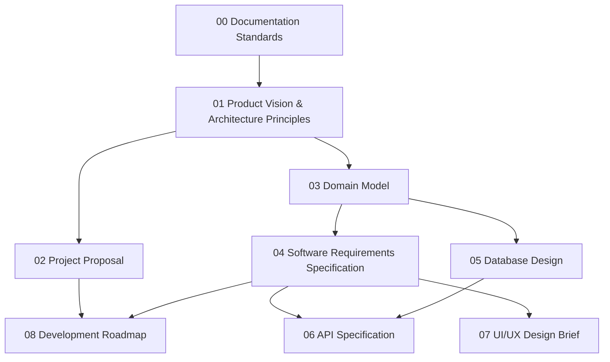

**Figure 12:** Documentation suite dependency model.

### 11.2 Explanation

This document is the foundation for every future document in the Gita Pathshala Management Platform documentation suite. It defines the product identity, operating philosophy, governance architecture, identity model, registry model, application architecture, authorization model, historical integrity expectations, and foundational ADRs.

Future documents should build on this foundation as follows:

| Future Document | How It Uses This Document |
| --- | --- |
| GP-PRO-002 Project Proposal | Uses the vision, scope, operating model, benefits, and phased product direction. |
| GP-DOM-003 Domain Model | Converts principles into entities, relationships, lifecycle states, and domain terminology. |
| GP-SRS-004 Software Requirements Specification | Converts operating model and principles into functional and non-functional requirements. |
| GP-DBD-005 Database Design | Implements person-centric identity, registry separation, operational records, history, authorization, and audit. |
| GP-API-006 API Specification | Exposes registry, operational, reporting, and authorization capabilities through stable contracts. |
| GP-UXD-007 UI/UX Design Brief | Designs role-aware experiences for the Management Portal and Learning App. |
| GP-RDM-008 Development Roadmap | Sequences delivery according to governance value, operational readiness, and implementation dependency. |

This document also defines what future documents must avoid:

| Avoid | Reason |
| --- | --- |
| Treating attendance as the product center | Attendance is one operational capability, not the platform vision. |
| Creating separate identities for student and teacher records | This breaks the person-centric model. |
| Combining registration and admission | This prevents clean transfers and history. |
| Combining teacher profile and assignment | This prevents accurate schedule and workload modeling. |
| Using role-only authorization | This weakens federated governance. |
| Overwriting business history | This damages audit, reporting, and institutional memory. |

### 11.3 Business Rules

| Rule ID | Business Rule |
| --- | --- |
| BR-11.1 | Future documents shall reference GP-VAP-001 when defining product scope, architecture principles, and foundational decisions. |
| BR-11.2 | Future documents shall not redefine core principles without an approved ADR. |
| BR-11.3 | Future documents shall preserve the distinction between registries and operational records. |
| BR-11.4 | Future documents shall preserve the two-application model unless formally superseded. |
| BR-11.5 | Future documents shall include diagrams, business rules, design decisions, notes, and open questions according to the documentation standard. |

### 11.4 Design Decisions

| Decision ID | Decision | Rationale |
| --- | --- | --- |
| DD-11.1 | Make GP-VAP-001 the governing foundation for the documentation suite. | It creates consistency across product, business, architecture, and implementation documents. |
| DD-11.2 | Allow future documents to elaborate but not contradict this document without ADR approval. | This keeps the suite coherent as detail increases. |
| DD-11.3 | Use document dependencies to prevent repetition. | Later documents should reference foundational principles rather than restating them in full. |

### 11.5 Notes

This document is version 0.1 and should be reviewed by product leadership, central governance representatives, architecture stakeholders, and implementation leads before being treated as a baseline for downstream documents.

### 11.6 Open Questions

| Question ID | Open Question |
| --- | --- |
| OQ-11.1 | What approval process will move this document from Draft to Approved? |
| OQ-11.2 | Should future documents use the same Markdown-first workflow, or should approved versions be exported to DOCX/PDF for governance sign-off? |

---

## Appendix A: Foundational Glossary

| Term | Definition |
| --- | --- |
| Central Governing Organization | The organization that governs the overall Gita Pathshala ecosystem, registries, policies, roles, and reporting. |
| Pathshala | A registered local Gita Pathshala that operates educational activities under central governance. |
| Person | The single registry identity for a human being. |
| User Account | Login and authentication record associated with a person when system access is required. |
| Student Admission | Operational record that connects a person to a Pathshala as a student for a defined lifecycle period. |
| Teacher Profile | Profile describing a person as an approved or recognized teacher. |
| Teacher Assignment | Operational record describing where, when, and what a teacher teaches. |
| Registry | Authoritative collection of stable organizational truth. |
| Operational Record | Record of an action, event, assignment, attendance, notice, or lifecycle activity. |
| Scope | The boundary within which a permission can be exercised, such as organization-wide, Pathshala-specific, committee-specific, or self-only. |
| Effective Permission | Final authorization result calculated from role, permission, scope, and approved overrides. |
| ADR | Architecture Decision Record documenting context, decision, rationale, and consequences. |

---

## Appendix B: Principle-to-Implementation Traceability

| Principle | Domain Impact | Database Impact | API Impact | UI/UX Impact |
| --- | --- | --- | --- | --- |
| Govern Centrally. Operate Locally. | Central and local responsibilities must be explicit. | Operational records need Pathshala scope. | APIs enforce scoped access. | Navigation and views change by role and scope. |
| One Person. One Identity. Many Journeys. | Person is the root identity. | Person table links to admissions, profiles, accounts, and roles. | Person search is required before admission and assignment. | Workflows select or create a person before assigning journeys. |
| Registration is Not Admission. | Admission is separate from person registration. | Admission table references Person and Pathshala. | Admission APIs manage lifecycle. | Admission screens distinguish person details from admission details. |
| Teacher Profile is Not Teacher Assignment. | Teacher profile and assignments are separate. | Assignments reference teacher profiles and schedules. | Assignment APIs support multiple placements. | Teacher schedule views aggregate assignments. |
| Registries Store Truth. Operational Records Store Activities. | Domain model separates stable truth from activity. | Registry and operational tables have distinct lifecycles. | API groups separate registry and workflow endpoints. | UI separates master data management from daily operations. |
| History Should Never Be Destroyed. | Lifecycle states and events are required. | Effective dates, statuses, audit fields, and event records are required. | APIs support close, transfer, correct, and history operations. | Users can view current state and history where permitted. |
| Authorization Must Be Explicit and Explainable. | Role, permission, scope, and override concepts are required. | Authorization tables and audit records are required. | APIs check effective permissions for protected actions. | UI hides unavailable actions and explains access where appropriate. |
| Build a Modular Platform Before Scaling Complexity. | Modules align to domain boundaries. | Schemas and ownership remain clear. | Contracts remain stable and versionable. | Applications consume backend services consistently. |

---

## Appendix C: Initial Risk Register

| Risk ID | Risk | Impact | Mitigation |
| --- | --- | --- | --- |
| R-1 | Product is reduced to attendance tracking during implementation. | Core governance and lifecycle needs remain unmet. | Use this document as scope foundation and require roadmap traceability. |
| R-2 | Duplicate person records are created across Pathshalas. | Reporting, history, and access become unreliable. | Implement person search, duplicate detection, and review workflows. |
| R-3 | Role-only authorization grants excessive access. | Users may access or modify records outside their scope. | Implement Role + Permission + Scope authorization from the start. |
| R-4 | Transfers overwrite previous admissions. | Student history is lost. | Model transfer and new admission as lifecycle records. |
| R-5 | Teacher schedules are stored directly on teacher profiles. | Multi-Pathshala and multi-slot assignments become difficult. | Separate teacher profile and teacher assignment. |
| R-6 | Reporting is deferred too long. | Central governance lacks visibility after rollout. | Include foundational operational reporting in early roadmap phases. |
| R-7 | Architecture becomes over-distributed too early. | Delivery slows and operational complexity increases. | Use modular architecture first and evolve services when justified. |

